# Speeding Up a Python Service with CinderX: JIT and Static Typing

Every Python optimizer has a number: how many times faster it is. It is measured on kernels, sorting, tree traversal, and arithmetic in a loop. The service works differently: the handler queries the database, performs calculations in NumPy, serializes the response, and the bytecode to which this number applies may be almost entirely absent from it. CinderX accelerates the bytecode, and this number does not extend beyond the bytecode. The proportion of bytecode in your service is a property of your code, not the extension, and until it is calculated, the decision of "whether or not to use it" is based on guesswork.

---

## What Is CinderX?

CinderX is a CPython extension: a binary package that is installed into an existing interpreter. It replaces the frame evaluator (the function that CPython calls to execute each frame), and execution proceeds through it from that point on.

Inside:

- **JIT** - compiles the entire object code into machine code.
- **Static Python** - a separate compiler for a typed subset of Python. It generates its own opcodes, which the JIT then translates into machine code.
- **Parallel garbage collector**, parallelizes the two garbage collection phases. Enabled by a call.
- **Lightweight frames** - in a compiled frame, only the subset of fields required by the machine code itself is filled in. The rest is completed if the runtime requests a full frame. Works in conjunction with the JIT.
- **Library primitives**, typed containers and primitive equivalents of built-in functions.

---

## JIT

The stock CPython 3.14 already includes a JIT: `--enable-experimental-jit` from PEP 744, also known as tier 2. So the question should be phrased differently: why do we need another one?

### These are two completely different compilers

| | CinderX | CPython 3.14, tier 2 |
|---|---|---|
| compilation unit | the entire object code | A route made up of UOPs, up to 800 of them |
| which starts the compilation | function call: counter, JIT list, or `force_compile` | Reverse transition, countdown timer starting at 4095 |
| interim presentation | HIR, then LIR, both in SSA; HIR is typed | No—a linear sequence of UOPs |
| Where does machine code come from? | is generated at runtime via ASMJIT | `memcpy` pre-assembled stencils plus a patch for the holes |
| register allocation | Linear scan using SSA with interval splitting | **No** |
| where the intermediate values are located | in machine registers | on the frame stack, in memory |
| inlining | According to HIR, a budget of 2,000 opcodes | a projection of the path through up to 5 frames |
| link count | a separate compiler pass | as in the interpreter |
| What You Need to Build It | nothing | LLVM 19, clang only |

### CPython: Copying and Patches

The idea behind "copy-and-patch" is to avoid having a compiler at runtime altogether.

The CPython tree contains the file ``Tools/jit/template.c``. This is the body of **a single** UOP (micro-operation into which the bytecode is decomposed), wrapped in a function with the signature ``(frame, stack_pointer, tstate)``. Everything that will vary at runtime is declared as holes with descriptive names: `_JIT_OPARG`, `_JIT_OPERAND0`, `_JIT_TARGET`, `_JIT_CONTINUE`.

During the CPython build phase, Clang compiles this stencil once for each uop and assembles the resulting pieces of machine code into a stencil table. This explains the requirement for LLVM 19 with clang: the template relies on "`musttail`," which GCC does not support.

In runtime, `_PyJIT_Compile` receives a track and does exactly what it says on the box: it follows the track, copies the desired stencil into executable memory, and fills the holes with real values. No parsing, no analysis, no instruction selection, that's why it's so cheap.

The chaining is held together by tail calls. Each stencil ends like this:

```c
#define PATCH_JUMP(ALIAS)                                                \
do {                                                                     \
    PATCH_VALUE(jit_func_preserve_none, jump, ALIAS);                    \
    __attribute__((musttail)) return jump(frame, stack_pointer, tstate); \
} while (0)
```

In other words, a trace is a chain of functions, each of which jumps to the next without growing the stack. The call convention `preserve_none` allows `frame`, `stack_pointer`, and `tstate` to be stored in registers throughout the entire chain.

**A value is passed from one uop to another via memory.** Since each uop is a separately compiled unit, the compiler has no way to pass a value from one uop to another via a register. The value produced by the ``_LOAD_FAST`` is placed on the frame value stack (in memory), from where the next uop will retrieve it. There is no intermediate representation. There is nothing to distribute.

What "copy-and-patch" achieves: the dispatch loop, with its ``switch`` and unpredictable branch, disappears. Plus, the abstract interpreter in `Python/optimizer_analysis.c` runs a data flow analysis along the path and eliminates what is provably redundant, duplicate type version checks.

What it doesn't do: adjacent UOPs don't share a common register, intermediate values are passed through the frame stack in memory, and operations on the reference counter aren't reordered based on liveliness. The analyzer does one thing with counters: it uses the borrowing variant for loading constants if the constant is immortal.

The path is constructed as follows. `translate_bytecode_to_trace` projects it along the hot path from the backtrack, and at each fork, it checks the branching history. Confidence starts at 1,000 and is multiplied by the fraction of matching transitions. If it drops below 333, the projection is terminated. The path is no longer than 800 uops and extends no deeper than five frames.

The entire process looks like this, a sequence of stages, and at each stage you can see what the seven-line counting loop has become:

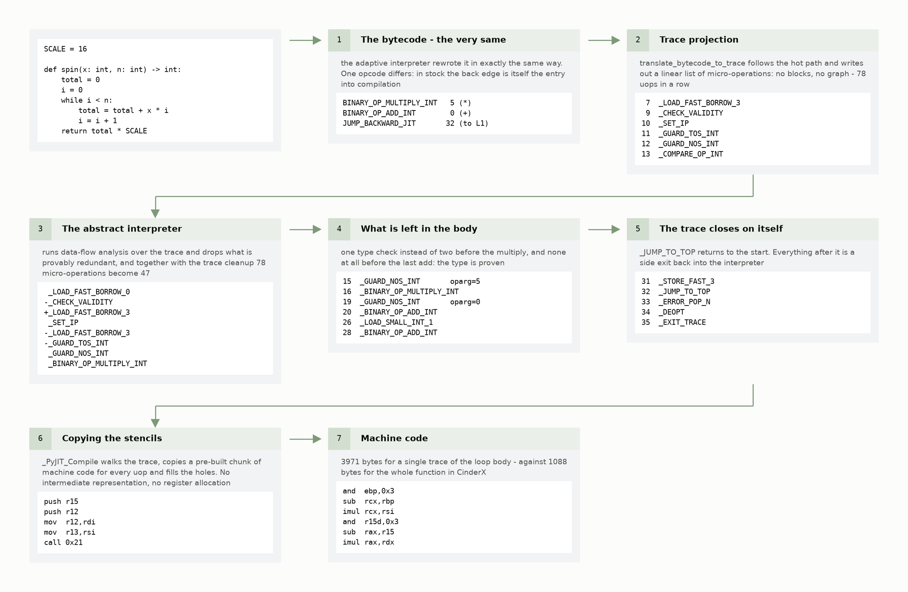

Please note the third and fourth steps. After analysis, 47 out of 78 microoperations remain in the trace. More than half of those removed, `_SET_IP`, and `_CHECK_VALIDITY`, are service state synchronization operations, and they are removed by a separate pass over the generated trace, rather than by the abstract interpreter itself. But at the same time, it proves the types: there is one check left before multiplication instead of two, and none at all before the final addition.

### CinderX: A True Compiler Method

A unit is an entire object code: a function, a method, or a lambda. It is not a trace, so there is no need to guess which branches to include. They are all compiled.

**`Preloader`.** A separate phase, and the only place in the entire pipeline where Python execution is permitted. It resolves global names under `LOAD_GLOBAL`, types, and call targets for Static Python opcodes in advance. Any execution of Python during compilation can break the compiler's assumptions. Therefore, this phase runs sequentially under the GIL, and thereafter, worker threads compile in parallel.

**Bytecode in HIR.** The CPython virtual machine is a stack-based machine, and its bytecode is written accordingly: an instruction takes its operands from the top of the stack and places the result there as well, so the values have no names. To eliminate unnecessary work from the code, one must first prove that it is unnecessary, and any such proof ultimately boils down to the question, "Where did this value come from, and who is using it?" You cannot ask such a question of the stack. Therefore, the compiler's first task is to rewrite the bytecode into a form where every value has a name, every instruction has explicit inputs and outputs, and every value also has a type. A type is just as mandatory here as a name: the work that the JIT eliminates (checks, unpacking, reference counters) exists only because the type is unknown. This is what HIR is.

It is not built from pure bytecode, but from bytecode **combined with what the CPython adaptive interpreter left behind.** When the interpreter sees that ``a + b`` always adds integers, it rewrites the opcode to a specialized ``BINARY_OP_ADD_INT``. The HIR builder reads this specific, specialized opcode and converts it into a type check:

```cpp
case BINARY_OP_ADD_INT:
case BINARY_OP_MULTIPLY_INT:
case BINARY_OP_SUBTRACT_INT:
  tc.emit<GuardType>(left, TLongExact, left, tc.frame);
  tc.emit<GuardType>(right, TLongExact, right, tc.frame);
  break;
```

The HIR builder recognizes twenty-two such specializations: arithmetic operations on `int`, `float`, and strings. Indexing of lists, tuples, and dictionaries. comparisons, unpacking sequences, and `LOAD_ATTR_MODULE`. It treats the remaining specialized opcodes as general ones: only those instructions that it can convert into a safety check, such as ``GuardType`` from the listing above, make it into the HIR.

This explains what can be seen in the graphs below: **JIT compiles what the interpreter has had time to process.** A function compiled before its first execution does not trigger any such checks: the HIR will be generated without a single ``GuardType``.

**HIR traversals.** After construction, conversion to SSA and type inference. In SSA, each name is assigned exactly once, so "where the value came from" is a single link traversal, not a graph search. All subsequent passes rely on this. Next comes the optimization pipeline: simplification, elimination of dynamic comparisons, removal of redundant type checks, elimination of phi-nodes, inlining, elimination of redundant method calls, and cleaning up the control flow graph.

The inliner operates on a budget: the cost of a function is the number of real opcodes, with a default limit of 2,000. Once the budget is exhausted, it stops inlining.

**`RefcountInsertion`** runs near the very end. It runs so late because each previous pass moves and discards instructions: if the counters were set earlier, correctness would have to be maintained throughout all those passes. Reference counting in CinderX isn't hard-coded into the opcodes: the compiler sets it up itself, based on metadata about how each HIR instruction handles references and memory. This is done to ensure correctness. On the other hand, the compiler treats `incref`and`decref` as regular instructions and can eliminate their pairs.

**HIR in LIR and machine code.** You can't allocate registers based on HIR: it describes Python operations (add, check type, call), while the allocator works with machine instructions and their limitations. We need a form where the instructions are already machine code, but there are still as many registers as needed: then the allocator has something to distribute. This is LIR, a fine-grained abstraction layer above assembly, also in SSA. The allocator hands out registers in a single linear pass through the function, splitting the lifetimes of values into parts if there aren't enough registers. From there, x64 code is generated via asmjit.

**Deoptimization.** Since the code relies on security checks, a way out is needed. The interpreter's state is represented in HIR by the following objects: `FrameState`, the offset of the current opcode, the contents of the operand stack, and the block stack. The ``Snapshot`` instruction locks it at a point in the program. ``Guard`` takes a Boolean operand and inherits ``FrameState`` from the nearest dominant snapshot.

In machine code, ``Guard`` is a comparison followed by a jump to a placeholder. There are three levels of placeholders: one for each check (which stores the metadata index), one per function (substitutes the runtime address and the address of the actual epilogue), and one jump to the runtime. It pushes fifteen registers onto the stack, calls ``prepareForDeopt`` to retrieve ``_PyInterpreterFrame`` via ``FrameState``, and transfers control to the interpreter via ``resumeInInterpreter``.

Here's the entire compilation process for the same function:

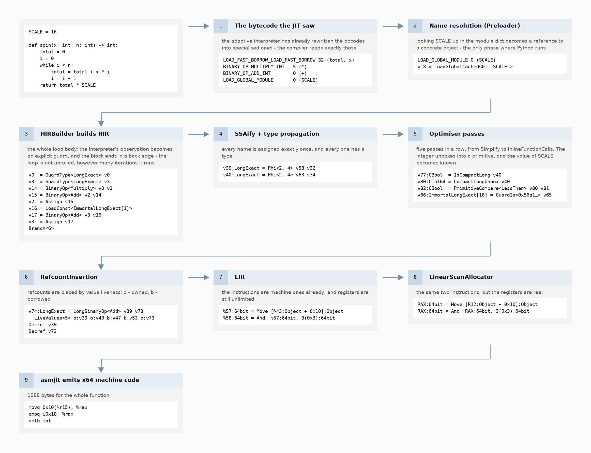

And this is what happens when a safety check fails, from two instructions within a function to a return to the interpreter:

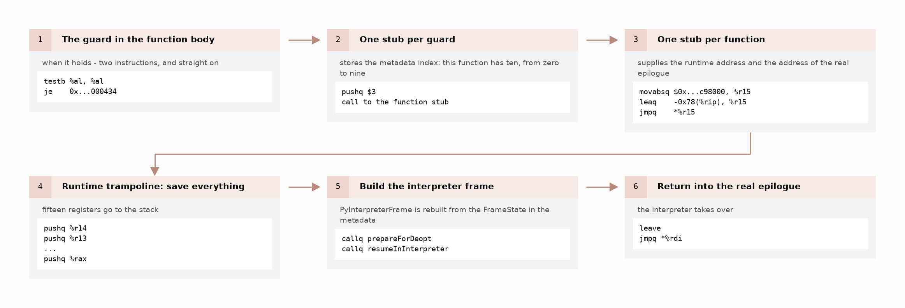

As long as the check succeeds, it remains at ``testb`` and the failed transition. Everything else in this diagram is executed only when the interpreter's observation turns out to be incorrect.

### What Each One Cleans Up

The difference lies in the task each person is working on.

Copy-and-patch eliminates dispatching. If your program hits a deadlock in the interpreter's loop, it will come out on top. If it gets bogged down by memory access, object allocation, and reference counting, there will be no gain: all of that remains the same.

CinderX can store values in registers and reduce reference counting, but only where it knows the types. And it knows only what the interpreter has had time to observe: ``int``, ``float``, ``str``, a list, a tuple, and a dictionary. For the fields of your structure, it has no offset, only an inline cache.

### Where exactly is the compiler activated?

To see the actual moment, rather than the average over a run, I recorded each of the 400 consecutive calls to a single function, "Life" on a 96×96 grid.

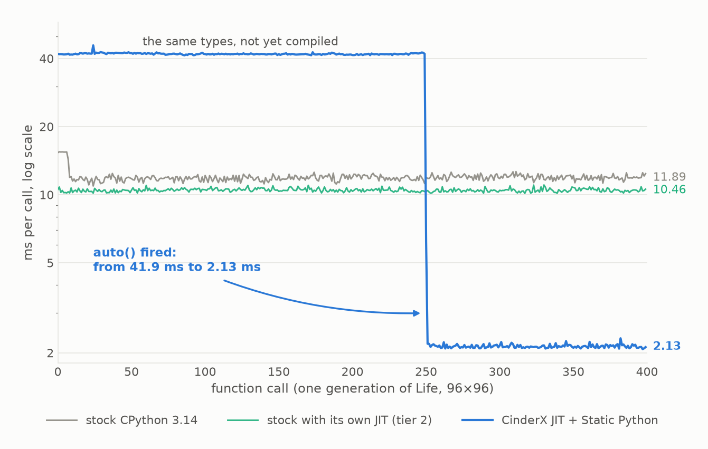

Blue line: After 250 calls, the function runs for 41.9 ms, then the counter reaches the threshold. On the next call, compilation occurs, taking 6.2 ms, and then the plateau lasts for 2.13 ms. A nineteen-fold drop, in steps, within a single process. The left half of this represents types without compilation: the annotations are already in the code, but the threshold has not yet been reached.

Two stock lines run side by side. The stock CPython 3.14 runs at 11.89 ms, while the same version from Tier 2 (`--enable-experimental-jit`) runs at 10.46 ms, meaning CPython's own JIT delivers a 1.14-fold improvement here. Within a single binary, the gap is smaller: with `PYTHON_JIT=0`, the build with tier 2 takes 11.54 ms, meaning it's 1.10 times as fast.

There are no steps at all for Tier 2 on the graph. Its threshold is calculated based on backtransitions, and the internal loop processing 9,216 cells completes its 4,095 steps on the very first call, so the green line runs below the gray one from the very beginning. However, another step is visible, and only in the stock version: the first seven calls take 15.4 ms each, because the adaptive interpreter is still rewriting the opcodes into specialized ones. And there's no way to verify that Tier 2 compiled your specific function: it has no function introspection at all. `sys._jit.is_enabled()` provides information about process configuration, `is_available()` about the build, and `is_active()` about the current frame at the time of the call, but not about the function itself.

### De-optimization You Don't Expect

The kind of deoptimization people remember is mixed data types: you compiled for integers, but a ``Decimal`` was passed in, and the frame went to the interpreter. This is predictable and can be fixed with strict input validation. Another type is costly, the one where you don't expect any security checks at all because the code isn't yours.

`__exit__` The generator context manager performs `next(self.gen)` inside `try`, catches `StopIteration`, and every exit from `with` results in deoptimization with the cause `UnhandledException`. Not just once per function, but for every pass through the block.

This can't be fixed in the fork: `contextlib.py` matches the stock version byte-for-byte. There is no replacement for `__exit__` in the tree. In other words, in the code that you didn't write and can't fix, the embedded compiler exits the compiled frame as many times as you've executed the `with` blocks.

There is a way to do this in the dialect, but not in `contextlib`. At `__static__`, there's a separate `ContextDecorator`, a regular class without a generator, and the compiler recognizes it by name: it discards the decorator entirely and rewrites the body of the decorated function into `with <decorator>._recreate_cm():` right inside it. No wrappers, no extra calls, not a single instance of deoptimization. This also works from an untyped module: there, the C implementation of input and output with type-based caching plays the same role.

### In a coroutine, JIT only takes the body

The compiler's routine is a standard object code: `force_compile` on `async def` returns `True`. Compilation takes one microsecond and produces 920 bytes of machine code, and not a single call to the interpreter was recorded during the two thousand measured calls. The compiler has no particular relationship to `async`.

In ``await f(x)``, three parts are executed: creating the coroutine object, executing its body, and, if it actually suspends, iterating through the event loop. Only the second part can be compiled.

| per call | stock | stock, Tier 2 | CinderX, JIT is disabled | CinderX + JIT | Static Python + JIT |
|---|---|---|---|---|---|
| A standard function, body: 64 iterations | 2525 | 2024 | 2909 | 1975 | - |
| `await`, an empty body | 111 | 113 | 185 | 187 | 231 |
| `await`, body of 8 iterations | 396 | 375 | 528 | 405 | 247 |
| `await`, body 64 iterations | 2567 | 2102 | 2986 | 2059 | 340 |
| `await` with a suspension | 2393 | 2474 | 2970 | 3002 | 2999 |

An empty coroutine takes 185 ns before compilation and 187 ns after. The pause times are 2970 and 3002. Both are asyncio code in C. There's no bytecode to compile there, and enabling JIT actually makes both lines run slightly slower.

It takes the body: 2,986 vs. 2,059 ns, a 1.45-fold difference. A regular function with the same body performs better, by a factor of 1.47, and the lighter the body, the more noticeable the difference: after eight iterations, the coroutine has a value of 1.30, while the function has 1.66. The difference is accounted for by that very fixed part, which the compiler does not touch.

Compared to stock CPython, the picture is worse. On the 64-iteration test, the JIT performs 1.25 times faster: part of the performance gain is offset by the time spent by the runtime itself, which, without the compiler, is more expensive than the stock implementation on every line of the table. But on an empty coroutine, the performance gain remains: 111 ns for the stock version versus 187 ns with the compiler enabled. With stock code compiled by its own JIT, the gap disappears entirely: on the body at 64 iterations, 2102 vs. 2059 ns. On eight Tier 2 coroutines, it's even ahead, 375 vs. 405.

A two-percent difference: on an untyped coroutine with a hot loop, the compiler built into the runtime catches up to CinderX, at no cost and without a single code change.

Without JIT, a typed coroutine runs in 539 ns on an empty body and 11.3 µs on a body with 64 iterations, that is, 2.9 and 3.8 times slower than an untyped one: the same performance degradation seen throughout this chapter. With JIT, the times are 231 and 340 ns. Sixty-four iterations of the typed body take 109 ns, or 1.7 ns per iteration, while the wrapper that launches this body takes 231 ns, twice as long as the actual work, and this wrapper is not in bytecode.

In the 64-iteration test, the typed coroutine is 7.5 times faster than the stock version. In the eight-iteration test, it is 1.6 times faster, and in the empty test, it is half as fast: 231 ns versus 111. The types begin to pay off with a fixed performance gain starting around the third iteration of the body.

The last row of the table shows the limit: a single ``await``, which actually cedes control to the event loop, costs about 2.6 µs in addition to the body, more than seven full typed calls with a body of 64 iterations. The handler that accesses the database pauses on every query, and typing the coroutine body reduces a term there, which is already negligible.

One caveat you'll run into within the first hour: the primitive return type in ``async def`` under JIT silently breaks the function, the call returns not a coroutine, but a pointer wrapped in ``int``, and ``await`` crashes with ``TypeError: 'int' object can't be awaited``.

| return type | JIT | The call returns | `await` |
|---|---|---|---|
| `int64` | off | coroutine | 84 |
| `int64` | enabled | int | TypeError |
| `int` | off | coroutine | 84 |
| `int` | enabled | coroutine | 84 |

If a function like this `await` is defined inside a typed module and the module is compiled, the process crashes due to an assertion in the compiler itself: `Only primitive numeric types should be boxed`. This can be fixed by using a boxed return type, declare `int` instead of `int64` and set `box()` as the return value. In this case, the primitives in the arguments remain primitives.

### Compilation Modes and Flags

Modes: `auto()` (by call count), `compile_after_n_calls(n)` (including zero), `force_compile` and `lazy_compile` (per item), `precompile_all(workers)` (in batches). What to compile, using JIT lists, including a file with wildcards.

All of these are set via the flags `-X cinderx-jit-*`, and almost every one has a corresponding environment variable `CINDERX_JIT_*`. In the JIT container, this is configured via the environment, without any code changes. The runtime itself prints a complete list, fifty-nine such flags, along with their descriptions:

```
python -X cinderx-jit-help -c 'import cinderx; cinderx.init()'
```

`cinderx.set_adaptive_delay(n)` `cinderx.delay_adaptive(bool)` are not located in the JIT module, but in `cinderx` itself. They adjust the threshold at which the adaptive interpreter begins to specialize opcodes, and allow specialization to be deferred until a function becomes "hot." In this build, the threshold is eighty. The gain is small, but the point is the same: compiling before the interpreter has specialized the opcodes means compiling without type checks, and, along with them, without the code that relies on those checks. On a counting kernel this costs a 40 percent difference: 6.09 ms without warm-up versus 4.35 ms after one.

Batch compilation: 200 functions one by one via `force_compile`, 368 ms. The same 200 via `precompile_all(workers=4)`, 88 ms, four times faster due to the parallel phase following name resolution.

### Which Diagnostic Findings Should Not Be Trusted

JIT shows what was compiled, how long it took, how many bytes were generated, and what the compiler saw, right down to the disassembler. Part of this doesn't answer the question you're asking: `is_enabled()` discusses the initialization of the subsystem, not your code, and `is_static_module(mod)` should be loaded from `__static__`, not from the JIT module. Otherwise, without the loader installed, the module from `import __static__` will run as regular Python, and you won't even know it.

And most importantly: **the call site, having called the function twice, continues to call the interpreter after ``force_compile()``.** At the same time, ``is_jit_compiled()`` returns ``True``, ``get_compiled_size()`` returns 2,408 bytes, and the disassembler prints the code, and this code, whether after one warm-up or two, matches instruction for instruction.


Without warm-up: 6.09 ms. After one warm-up: 4.35 ms. After two warm-ups: 8.57 ms, and it stays that way no matter how much you warm it up. Polka is as fast as a pure interpreter. You can see this in detail at `count_interpreted_calls`: with one warm-up, zero out of fifteen calls went to the interpreter. With two, fifteen out of fifteen. `auto()` and `compile_after_n_calls(n)` do not suffer from this, nor does Static Python: typed functions follow their own call path, and warm-up means nothing there.

If you're measuring JIT via `force_compile`, the only relevant metric is `count_interpreted_calls`. Everything else describes a compilation artifact, not what is actually being executed.

## Static Python

When there are few inline caches or they are polymorphic, annotations provide the compiler with information it cannot determine on its own.

### Specialized opcodes instead of attribute lookups

A separate compiler reads the annotations and generates specialized opcodes: accessing a field via a calculated offset instead of looking up an attribute, a direct call instead of name resolution, and primitive arithmetic instead of ``PyNumber_*``.

Checks are performed at the boundary, not everywhere. During import, the compiler rejects the module, and it simply won't load. At runtime, the system checks argument prologues, explicit casts, the return values of overridden methods, and Python-style container accesses. Inside the perimeter, access to a field is a raw offset, without attribute lookup or type checking.

### Primitives, Containers, and Boundary Operations

Primitives: `int8`…`int64`, `uint8`…`uint64`, `cbool`, `char`, `double`, `size_t`. Containers with verified element types: `Array[int64]`, `CheckedDict`, `CheckedList`. Boundary operations: `box`/`unbox` and `cast`, unlike `typing.cast`, these perform actual runtime verification. Primitive versions of the built-ins: `clen`, `crange`. Custom decorators: `@inline`, `@native`, and `@dynamic_return`, the latter removes the runtime check on the return type: the annotation remains visible to the reader and the type checker, but runtime no longer verifies it. And `final` from `__static__` is literally a re-export of `typing.final`. It doesn't become new, but it ceases to be merely a suggestion: the compiler begins to check it and, based on it, calls the method directly, without virtual dispatch.

**A primitive has a fixed width.** A Python integer never overflows, but a primitive overflows in each of these cases:

| expression | value |
|---|---|
| `int8` 127 + 1 | −128 |
| `uint8` 255 + 1 | 0 |
| `int16` 32767 + 1 | −32768 |
| `int32` 2147483647 + 1 | −2147483648 |
| `uint64` 0 − 1 | 18446744073709551615 |
| `int8(int64(300))` - narrowing | 44 |

No line raises an exception. A counter, hash, or product that would have resulted in long arithmetic in standard Python will be reduced to modulo after porting.

**What the port looks like.** Here is the graph traversal kernel from the service, the measurements are based on it. It used to be:

```python
def walk(indptr, indices, weights, seeds, scores, touched) -> int:
    n_touched = 0
    for seed in seeds:
        p = indptr[seed]
        pe = indptr[seed + 1]
        while p < pe:
            nb = indices[p]
            w = weights[p]
            prev = scores[nb]
            if prev == 0:
                touched[n_touched] = nb
                n_touched += 1
            scores[nb] = prev + w * DECAY_FIRST
```

It became:

```python
def walk(indptr: Array[int64], indices: Array[int64], weights: Array[int64],
         seeds: Array[int64], n_seeds: int64,
         scores: Array[int64], touched: Array[int64]) -> int64:
    n_touched: int64 = 0
    s: int64 = 0
    while s < n_seeds:
        seed: int64 = seeds[s]
        p: int64 = indptr[seed]
        pe: int64 = indptr[seed + 1]
        while p < pe:
            nb: int64 = indices[p]
            w: int64 = weights[p]
            prev: int64 = scores[nb]
            if prev == 0:
                touched[n_touched] = nb
                n_touched = n_touched + 1
            acc: int64 = prev + w * 16
            scores[nb] = acc
```

The algorithm hasn't changed a single line. However, annotations weren't the only changes: the data representation, function signature, counter declarations, and named constants have all changed.

**Data Representation.** Lists have become `Array[int64]`. You have to populate them yourself, element by element: there is no ready-made constructor for lists in this dialect, and the copy operation runs through the entire input before typed processing begins.

**Signature.** The caller allocates buffers for the result: the typed version of the candidate selection fills the passed `out_ids`/`out_scores` and returns a counter, while a separate `boxed_pairs` collects Python tuples from them. The wrapping is performed once for each top result returned, rather than for every candidate that is processed.

**Counters must be declared.** A value retrieved from ``Array[int64]`` is automatically typed: ``nb = indices[p]`` is ``int64`` without any annotation. However, a counter initialized with a literal will not compile:

```python
total = 0
for i in crange(n):        # i: int64
    total = total + i
# TypedSyntaxError: invalid union type Union[int64, Literal[0]];
#                   unions cannot include primitive types
```

You have to report everything that starts from scratch: every meter reading and every amount.

**Named constants are gone.** Where the standard version uses ``w * DECAY_FIRST``, the typed version uses ``w * 16``. A module constant cannot be confused with a primitive in any way, and it cannot be declared as a primitive: primitives are prohibited within the module's scope.

Furthermore, a ported module becomes immutable. After import, both the module and the classes declared within it are frozen: assigning a value to a module attribute results in ``AttributeError: cannot modify attribute... of strict module``, and adding a method to a class results in ``TypeError: cannot set... attribute of immutable type...``. The freezing occurs at the end of the module body, so assigning a value to a class is valid inside the module but not outside it. It is possible to inherit from a frozen class. The subclass remains ordinary. Adjacent untyped modules and the standard library are not affected.

For testing purposes, this means that `mock.patch` does not work with this module. The standard workaround is to build the loader from `enable_patching=True` and use `StrictModuleTestingPatchProxy`.

Another issue isn't immediately apparent: ``functools.cached_property`` stops working entirely in a typed module. The classes are slotted, there is no instance dictionary, and the descriptor has nowhere to store the value, `TypeError: No '__dict__' attribute on 'S' instance to cache 'x' property`. A workaround is provided by `cached_property` from `cinderx`: the compiler extracts the body into a separate method, adds a field to the slots, and reads it using a direct offset. Under JIT, this is also about one-third faster than the standard approach, and the speedup is specifically due to the slot: the same implementation in a regular class from `functools` is indistinguishable.

The observed behavior also changes, and it's best to be aware of this in advance: classes receive slots automatically (meaning ``AttributeError`` works where it used to, and weak references must be resolved using the decorator `@allow_weakrefs`, which appends `__weakref__` to the slots). Named arguments are converted to positional ones wherever the compiler allowed a static call (meaning `mock.call_args` will show positional arguments). Multiple inheritance with expansion fails, two static classes cannot be combined (`TypeError: multiple bases have instance lay-out conflict`), and this is handled by the decorator `@mixin`, which removes the class entirely from static compilation.

### Common Tactics That Don't Work Here

Everything in the table is written without a second thought in standard Python. The compiler rejects this during import, and the module raises an exception with ``StrictModuleError``, the diagnostic text is in the right-hand column. There is one exception: ``class C(A, B)`` is allowed to pass, and the exception is raised when the class is created.

| what you're writing | What You'll Get |
|---|---|
| `for i in range(n): a[i] = i` | `type mismatch: dynamic cannot be assigned to int64` |
| `SHIFT: int64 = 12` in the module | `cannot use primitives in global or closure scope` |
| `SHIFT: Final[int] = 6`, then `w >> SHIFT` | `cannot right shift int64 and int` |
| `print(n)`, where `n: int64` | `Call argument cannot be a primitive` |
| `class C(A, B)`—both have fields | `TypeError: multiple bases have instance lay-out conflict` |
| An attribute and a method with the same name | `function conflicts with other member attr` |
| `x: int` Announced in both threads: `if` | `Cannot redefine local variable x` |
| `a == b or x > y` - `cbool` next to the dynamic value | `invalid union type Union[cbool, dynamic]` |
| Overriding the ``@final`` method | `Cannot assign to a Final attribute` |

Index-based loops and named constants are found in any machine code, so it's worth taking a closer look at them.

Index-based cycle:

```python
for i in range(n):
    a[i] = i
# TypedSyntaxError: type mismatch: dynamic cannot be assigned to int64
```

`range()` returns `dynamic`. The conversion from `dynamic` to `int` is allowed as an implicit checked cast, but `dynamic` to `int64` is not. You must replace it with `crange`, the primitive equivalent, or with an explicit `while` with a counter. Iteration over `Array[int64]` itself is typed: the loop variable takes the type `int64`, so no conversion is needed. With a regular list, it's again `dynamic`, and each element will have to be passed through `int64(v)`.

Named constant:

```python
SHIFT: Final[int] = 6
acc: int64 = (w * w2) >> SHIFT
# TypedSyntaxError: cannot right shift int64 and int
```

A module constant does not participate in primitive arithmetic, neither as ``Final[int]`` nor as a regular global variable. In the latter case, the diagnostic simply changes to ``cannot right shift int64 and dynamic``. It also cannot be declared as a primitive: primitives are prohibited within a module's scope. That leaves `>> int64(SHIFT)` or upcasting to a typed local variable at the beginning of the function. Alternatively, as shown in the examples in this article, it can be expanded into a literal.

### Price without JIT

Here's what one iteration of a counting loop consisting of two additions and a comparison costs, assuming only the configuration is changed:

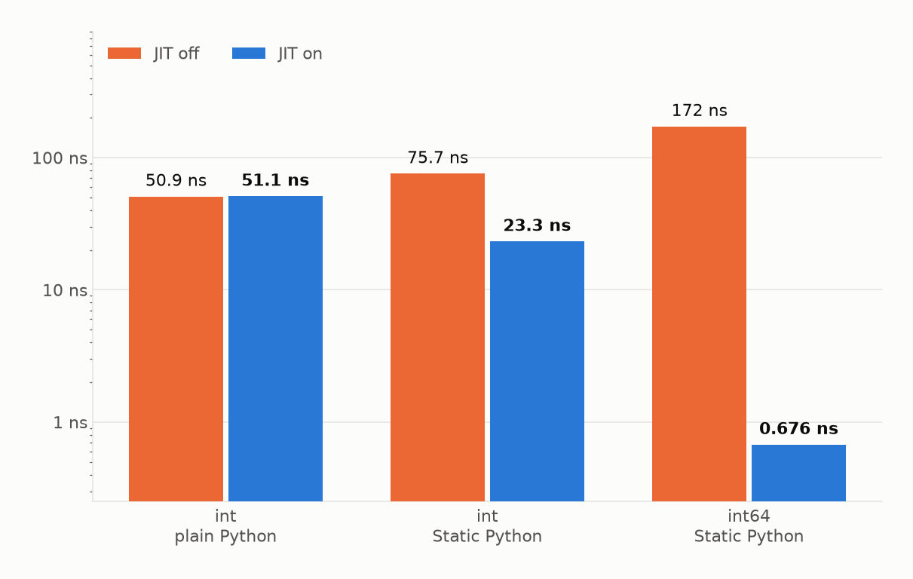

The standard Python ``int`` takes 50.9 ns. The same ``int`` in Static Python takes 75.7 ns. ``int64`` in Static Python takes **172 ns**, that is, 3.4 times worse than where we started.

We enable JIT without changing anything else: `int64` - **0.676 ns**. This is 255 times faster than the same code without JIT and 75 times faster than the standard `int`.

Seventy-five is the best result you can get. If you introduce a data dependency into the same loop (`(s * 31 + i) & 1048575` instead of the addition), it takes 2.53 ns, twenty times slower than the usual `int`. The difference is that the chain with the data dependency doesn't distribute across the registers as freely.

In the interpreter, ``int64`` is still ``PyLong``. The opcode for the primitive operation unpacks both operands into a machine word, performs a single C operation on them, and packs the result back into a fresh ``PyLong``, with allocation. Plus, `EXTENDED_OPCODE`, two dispatchers instead of one. By declaring a machine type, you get the same operation plus the packing and unpacking around it. **Static types are the entry point for JIT: without them, the machine representation doesn't appear anywhere.**

### Field Access Fee

Primitive arithmetic is rarely written out, but object fields are used all the time, so it's worth asking the same question about them as well.

| pre-surgery | stock | stock, Tier 2 | CinderX + JIT | types, JIT disabled | types + JIT |
|---|---|---|---|---|---|
| field reading | 35.7 | 34.6 | **19.7** | 72.7 | **16.2** |
| reading and writing | 73.0 | 65.1 | 51.4 | 115.9 | **44.4** |

The compiler has no way of knowing the offset of your class's field. It relies on an inline cache that it creates itself and fills on the first miss. This alone is enough to cut the time by almost half: 19.7 ns versus 35.7 ns for the stock implementation. Types provide what the cache can't: an offset known at compile time. That's 16.2 ns, another fifth off the top. For a "read and write" pair, both improvements are the same, just more modest: 51.4 versus 73.0 for the stock version and 44.4 with types, each iteration involves one additional read and write, and the savings grow more slowly than the workload itself.

However, the CinderX interpreter performs worse than the stock version when reading fields: 43.6 versus 35.7. Without a compiler, the extension only gets in the way here.

Types without JIT are twice as bad as the stock implementation, 72.7 vs. 35.7: the same performance hit as with arithmetic. In a typed class, the field is located at a calculated offset, and in the compiled code, accessing it requires a single load instruction. The NULL check and reference count remain next to it.

### The Price of the Border

The scope of the static code is entered each time the kernel is called from the handler, and that is where all the checks are performed:

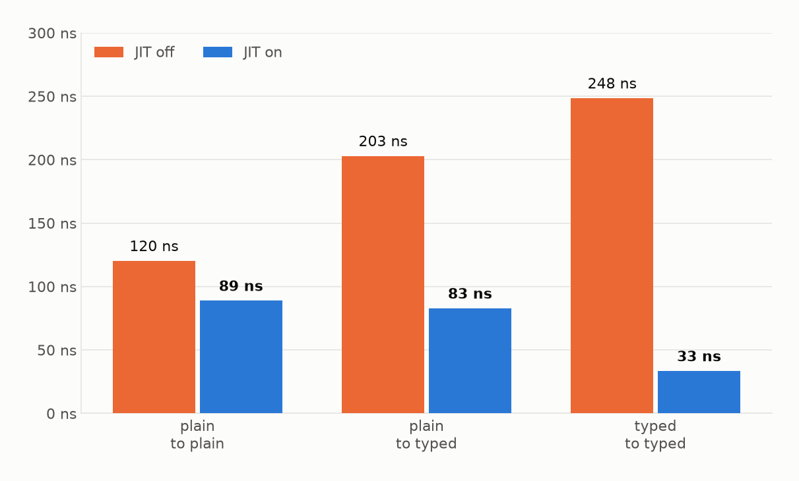

Without JIT, the transition to typed code is more expensive than usual: 203 ns versus 120, a 1.7-fold difference. With JIT, the overhead disappears entirely, 83 ns versus 89 ns, meaning that the typed transition is even slightly cheaper than the untyped one, and this happens only when combined with compilation.

The third column in the graph measures something else. There, the entire cycle runs within a static perimeter, and without JIT, it incurs the penalty of a static interpreter from the section on primitives (248 ns), while with JIT, it is compiled entirely along with the call (33 ns). It cannot be compared to the first two columns, and this is noted separately in the measurement itself.

---

## A Library: Something That Takes the Work Out of It

Up until now, everything has been about speeding up the bytecode. The extension also includes another component, primitives that reduce the amount of work.

### One computation for any number of waiting users

`AsyncLazyValue` It wraps the coroutine and provides a guarantee: no matter how many times it is awaited, the body will execute only once. Fifty simultaneous awaits of the same value:

| | body postures |
|---|---|
| Call Korutina fifty times | 50 |
| One `AsyncLazyValue`, fifty waiting | **1** |

You can't get around using a variable here: the coroutine object is single-use. Attempting to reuse it `await` results in an error `cannot reuse already awaited coroutine`. `AsyncLazyValue` stores the state and a list of waiting coroutines `Future`: the first one `await` starts the computation, the rest are added to the list, and upon completion, the result is distributed to all of them at once.

| ns for one wait | CinderX, JIT is disabled | CinderX + JIT |
|---|---|---|
| `await` fresh corutina | 185 | 187 |
| `await` ready-made `AsyncLazyValue` | 123 | **45** |
| The finished version is available at `AsyncLazyValue` via `async_cached_property` | 128 | 69 |

Without JIT, the precomputed value is one and a half times cheaper than a fresh call. With JIT, it's four times cheaper. The compiler leaves the fixed price of the standard ``await`` completely untouched, 185 and 187 ns, while the path through ``AsyncLazyValue`` reduces the time from 123 to 45.

`async_cached_property` - The same thing expressed as a property: the first read adds ``AsyncLazyValue`` to the instance's dictionary. After that, it's a standard attribute lookup. The 25-nanosecond difference under JIT is the cost of this lookup on top of the pre-calculated value.

There are no equivalents in the standard library: `functools.cached_property` is synchronous. An asynchronous version hasn't been added yet.

---

## Process: Memory and Forking

Heap immortalization and the parallel collector operate at the process level and are combined into a single pre-fork sequence.

### Memory: Immortalization

`immortalize_heap()` It works more simply than it sounds: it collects garbage, calls ``gc.freeze()``, and iterates through the resulting permanent generation, marking every object as immortal, along with whatever that object passes to ``tp_traverse`` in a single step. There is no transitive closure on the graph: it targets what the garbage collector has tracked, along with its direct references, plus manually specified exceptions, the contents of dictionaries, constants, and code object names. The reference counters for marked objects stop changing, which means that after `fork()` these pages should not be copied during reading.

The stock CPython implementation includes both: ``gc.freeze()`` starting with 3.7, and `immortal objects` starting with 3.12. However, ``gc.freeze()`` only removes objects from the garbage collector's traversal, regular reference counters continue to change with each read, and copy-on-write still takes effect.

You can verify this directly. A parent process creates a list of 400,000 dictionaries and forks it into four worker processes. Each worker process runs through the entire list three times, and the results are retrieved from `/proc/<pid>/smaps_rollup`.

| arm | PSS on the walker | Shared_Dirty | Private_Dirty |
|---|---|---|---|
| as is | 103.3 MB | 66.8 MB | 86.6 MB |
| from `gc.freeze()` | 103.4 MB | 66.8 MB | 86.6 MB |
| from `immortalize_heap()` | 103.2 MB | 67.1 MB | 86.4 MB |

All three columns match: immortalization did not affect either the total memory usage or the size of the private dirty pages, 86.4 MB versus 86.6. With this data set, 400,000 small dictionaries read sequentially, pages were copied during reading in exactly the same way as without immortality.

### Pauses: A Parallel Compiler

The parallel assembler is a copy of the stock assembler from `Python/gc.c`, in which two of the nine collection phases have been parallelized.

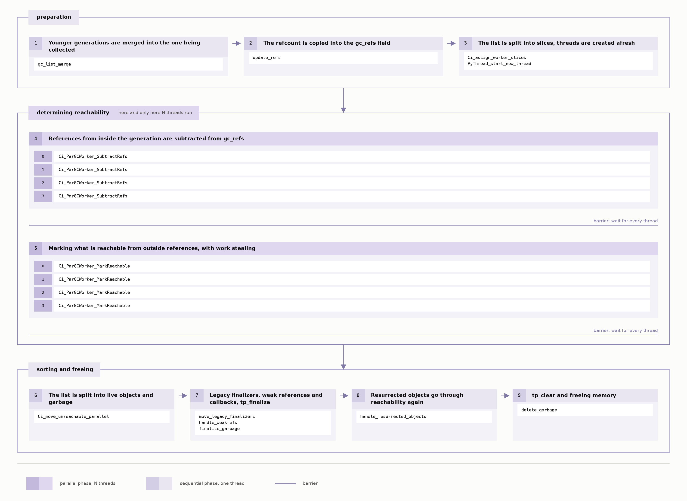

First, references pointing inward to the generation being collected are removed from the copied counters: after this, only those objects that are referenced from outside retain a nonzero counter. Then, everything reachable from them is marked. Both passes traverse the graph via `tp_traverse`, and both end with a barrier, no one will move any further until the slowest thread has finished.

Everything else happens sequentially. Sorting the list into "live" and "garbage" objects, contrary to the name "`Ci_move_unreachable_parallel`", takes place in the main thread. Finalizers, weak references, `tp_clear`, and memory deallocation do as well.

So, the gain is limited to the ratio of these two passes. And that ratio itself can be reduced to zero, by freezing.

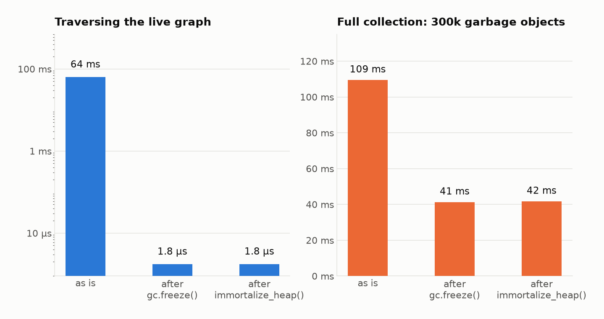

Left panel: traversing a live graph with 300,000 nodes, 64 ms. After `gc.freeze()` or `immortalize_heap()`, 1.8 μs. Thirty-six thousand times faster: the garbage collector does not traverse frozen objects at all.

Right panel, a full collection with 300,000 garbage objects: 109 ms as-is, 41 ms after freezing. The performance gain here is only 2.65 times: freezing removes the live graph traversal from the run (64 ms), but the 300,000 garbage objects remain. They still need to be traversed and freed.

The parallel collector on the same graph falls short, and by a wide margin: four threads complete the task in 145 ms instead of 64, and the full compilation takes 184 ms instead of 109. However, the nodes here are objects with three fields, and there are four threads. Both of these parameters are unfavorable for it, and they need to be analyzed separately.

#### The form of objects determines whether it makes sense at all

His overhead is associated with the object, not the operation: each visit is an atomic operation on the header plus an access to the steal queue. Therefore, given the same heap containing two million references, everything depends on how those references are distributed across objects. The coefficient next to the time indicates how many times faster parallel compilation is than sequential compilation. In other words, any value less than one represents a loss.

| references to the object | objects | sequentially | 2 streams | 4 streams | 8 streams |
|---|---|---|---|---|---|
| 3 | 666,000 | 40.1 ms | 115.1 ms, 0.35× | 111.1 ms, 0.36× | 75.5 ms, 0.53× |
| 10 | 200,000 | 17.1 ms | 49.0 ms, 0.35× | 38.5 ms, 0.44× | 29.7 ms, 0.58× |
| 30 | 67,000 | 12.7 ms | 26.5 ms, 0.48× | 21.8 ms, 0.58× | 16.6 ms, 0.77× |
| 100 | 20,000 | 12.2 ms | 26.2 ms, 0.46× | 15.9 ms, 0.76× | **10.8 ms, 1.12×** |

With three references per node, the parallel collection is twice as slow even in its best configuration, and no number of threads can fix that. It starts to win somewhere between thirty and a hundred references per object. The view cache, which the compiler tests further in the workshop, holds 107.5 references per object, that is, right at that threshold.

#### How many threads does it need?

The second parameter is the number of threads. The assembler has no thread pool: ``PyThread_start_new_thread`` is called directly within the loop, and threads are created anew for each collection. You can see how much this costs on its own from the frozen heap in the previous measurement: a sequential collection fits within 1.8 µs, while four threads spend 409 µs just to be created and then discover that there is no work to do.

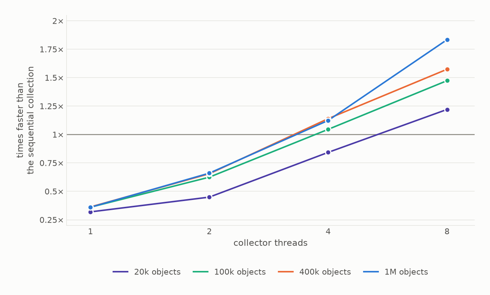

A single thread is always about three times worse than sequential collection: atomicity has already been paid for, but the parallelism that would make it worthwhile is not yet there. Two threads are one and a half times worse, and on the smallest heap, more than twice as bad. Four threads finally reach the level of sequential compilation. The performance gain begins at eight: with a million objects, 601 ms is reduced to 328 ms, that is, 273 ms is shaved off for each full pause.

Beyond the first two points, the curve rises almost proportionally: each doubling of the number of threads speeds up collection by about one and a half times, and all four heap sizes behave identically. This is exactly what you'd expect from parallel layout, the work is divided into slices, and the slices are distributed across the cores.

The size of the heap determines the point at which the performance gain begins. The thicker the slice on the worker, the lower the fixed cost of creating a thread: with a million objects, eight threads provide a 1.83-fold speedup, while with twenty thousand, the speedup is only 1.22-fold.

By default, half of the machine's cores are used. On a four-core machine, this means two threads. On a two-core machine, one thread, that is, both points on the loss side of the curve. It is better to specify ``num_threads`` explicitly.

#### When Does a Parallel Assembler Pay for Itself?

Both conditions must be met: objects with 100 references each and eight cores that can be given to collection. Then it already gains an advantage with twenty thousand such objects, and the larger the batch, the greater the gain, almost a fifth of the pause time at twenty thousand, almost half at one million.

The heap can take any form. A memory cache with complex values, a lookup table or index that the service maintains between requests, a parsed configuration tree, or an ORM session with tens of thousands of entities, any of these will work.

`min_generation=2` By default: the parallel branch runs only on full collections, and it is not visible in the allocation cycle, 0.493 ms versus 0.489 ms. It's not worth lowering the threshold: young collections are small and frequent, each one incurs the cost of creating threads, and the same cycle slows down to 0.75–0.84 ms.

### Sequence in the parent before the fork

Taken together, this results in a single sequence in the parent class up to the fork:

```python
import cinderx
import cinderx.jit as jit
from cinderx.compiler.strict.loader import install as install_strict_loader

cinderx.install_frame_evaluator()
install_strict_loader()
jit.enable()
import app

cinderx.enable_parallel_gc(min_generation=2, num_threads=N)
jit.precompile_all(workers=N)
cinderx.immortalize_heap()
```

Compilation occurs on the second-to-last line: 88 ms for 200 functions. The order is important here: compilation units are registered when a function is created and only if JIT is already enabled, so ``jit.enable()`` must come before the application import, otherwise, ``precompile_all`` will run in vain. After that, the parent forks, and each worker still needs to open a connection pool.

---

## Workshop: The Same Thing on the Service

The service generates item-to-item recommendations based on a weighted co-occurrence graph. The catalog contains 100,000 products and 20,000 users. The graph has 2.5 million edges. The top percentage of products is more than five times as densely connected to the rest and accounts for three-eighths of all edges, so the traversal almost always converges on this core. The load consists of 20,000 products and 3,000 users.

The three pens were chosen so that time would be spent for three different reasons:

| pen | conveyor | where time |
|---|---|---|
| `POST /v1/recommendations` | record from the database, depth-first graph traversal, scoring, business rules, top-K | **Python bytecode** |
| `GET /v1/items/{id}/similar` | Embedding × candidate matrix, top-K by cosine | **C, using NumPy** |
| `GET /v1/items/{id}/bundle` | cached view, slot re-partitioning, top-K | **Pauses by the collector** |

Load: k6 in the open model. Step 60 seconds after a one-minute warm-up period (not counted). The fixture is reset before each configuration. A step is considered failed if p99 is greater than 1000 ms, errors exceed 1%, or less than 95% of the target is delivered.

### `POST /recommend`: Where Time Is Lost in Bytecode

The pipeline for this endpoint, graph traversal, scoring, and business rules, is pure Python bytecode, which is exactly what CinderX is designed to accelerate.

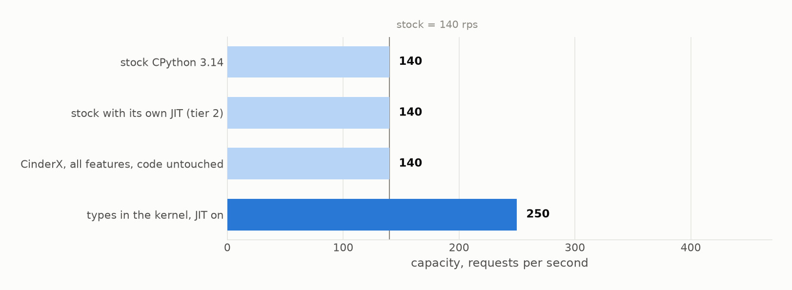

The stock CPython 3.14 handles 140 requests per second. The stock version with its own JIT handles the same 140. CinderX, with all its features: the runtime installed, the compiler enabled, hot function precompilation before a fork, heap immortalization, and a parallel collector. And **the same 140**.

Types on the kernel with JIT enabled, **250 rps**, is nearly double that of the stock version, and this is the only configuration here that required code changes.

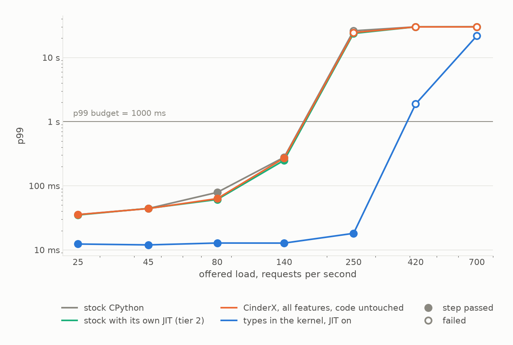

In stock mode at 140 rps, the P99 is 279 ms, the service is already at its limit. With types and JIT at the same feed rate, the P99 is **13 ms**: twenty times less under the same load. The curve shifts to the right by one step in feed rate, and up to 250 rps, the service remains within 18 ms.

But they don't touch the tail of the configuration. In all configurations without modifying the p99 code, the value at 140 rps falls between 220 and 460 ms, and which one is better varies from run to run. The reason becomes visible on the third endpoint: the live heap of this endpoint is the product catalog, which was loaded before the fork and frozen along with it.

### `GET /similar`: Where Time Goes in C

The second function calculates cosine similarity using NumPy. Since typing the kernel gave nearly a twofold improvement, the next logical step suggests itself: what if we type this one as well? The final configuration addresses this.

The first three configurations are indistinguishable: `/similar` handles 330 requests per second on stock, on stock with Tier 2, and on CinderX with all features enabled. The fourth configuration, where even the scan has been rewritten in Static Python, delivers 35 requests per second, and the p99 on this load increases from 12 ms to 246 ms.

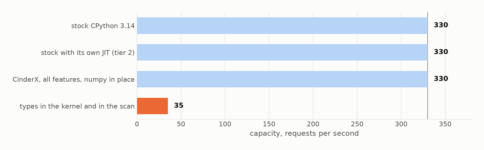

The first three bars are easy to explain: CinderX speeds up bytecode, but this test didn't use bytecode. It ran in NumPy. An isolated measurement of the same scan confirms this: 7.72 ms without the extension, 7.79 ms with the runtime installed, and 8.35 ms with the compiler enabled. It didn't get any faster on any configuration.

The fourth point is what happens when the code is converted back to bytecode so that the compiler has something to optimize. And it did speed it up, significantly: a typed scan without JIT takes 6,310 ms, while with JIT it takes 109 ms, fifty-eight times faster. But overall, the endpoint ended up nine times worse overall, because before the rewrite, the same operation cost almost nothing.

The delay screens show the same information, but in more detail:

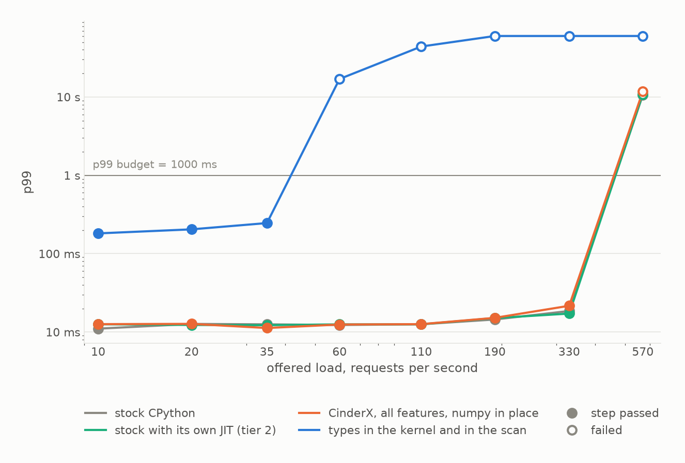

The first three lines overlap for 12–13 milliseconds up to the 110th request. They then diverge to 14–22 ms and taper off together after the 330th. The fourth line begins at 182 ms, fourteen times higher, and exceeds the budget as early as sixty requests per second. The knee shifts to the left by four request steps.

The tail here is the same story as at `/recommend`: the settings have no effect on it. Up to 110 requests per second, all three return 12–13 ms. At the 190th request, 14–15 ms. At the 330th, they range from 17 to 22 ms, and the order varies from configuration to configuration. This counter is located inside NumPy, on top of the matrix loaded before the fork, which was removed from the loop by immortalization.

`/recommend` In the same configuration, it remained at 250 rps.

Not only can the proportion of bytecode be increased, but it can also be accidentally reduced: moving the code from NumPy back to Python resulted in a ninefold loss of capacity, whereas typing the kernel brought a twofold gain.

### `GET /bundle`: Where Time Is Lost in Compiler Pauses

The third endpoint is built so that it's not the work that's expensive, but the memory behind it. After the fork, the worker warms up the cache of product listings: for each of the forty thousand products, there is a neighborhood based on the co-occurrence graph, organized into five lists of one hundred twenty-eight elements each. The request itself is cheap: fetch a storefront from the cache, scan through 128 slots, and return 24. At 2,000 requests per second, the median response time stays at 2 milliseconds. The exception is the stock section, where it fluctuates between 1.9 and 12.8 ms from run to run.

But this garbage collector walks this cache in full on every full collection: 240,000 tracked objects, 25,800,000 references, and 107.5 references per object. That's exactly the scenario where a parallel garbage collector pays off.

However, this cache is not frozen. ``immortalize_heap()`` is called in the Gunicorn master process, before the fork, and removes the graph, directory, and embeds from the cache. The storefronts are built in the worker process, after the fork, and remain visible.

The collection here is timed, once every two seconds, and each collection is measured from within the process. That's why this entry has something the other two don't: the duration of the pause itself, not just its trace in the query tail.

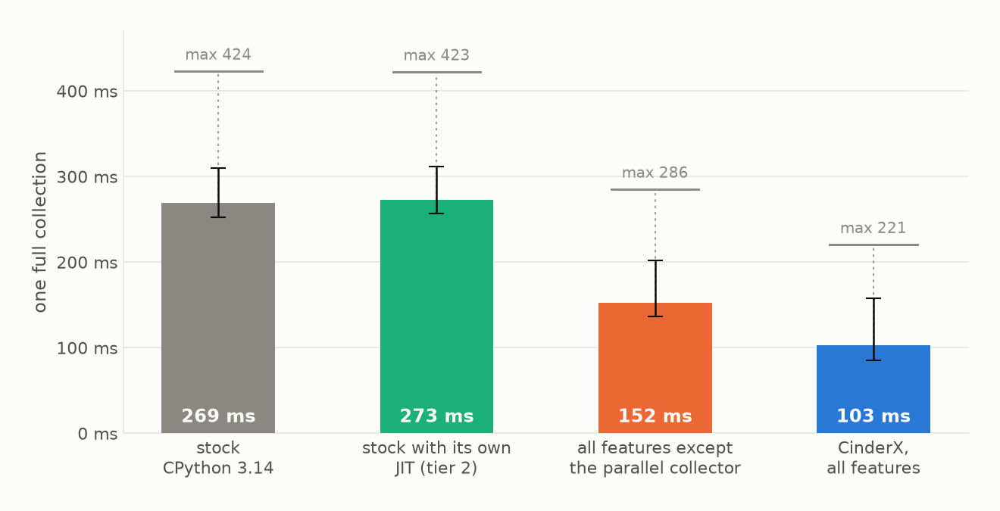

The freeze reduces it by 1.76 times, and the parallel collector on top reduces it by another 1.48 times. Combined, 269 ms becomes 103 ms, and the maximum drops from 424 to 221. At Tier 2, the pause is the same as in the stock version: 273 ms versus 269 ms. The JIT and the garbage collector never overlap.

Capacity doesn't affect this at all: 4,500 requests per second across all four configurations. The difference is only visible in the long-tail latency distribution.

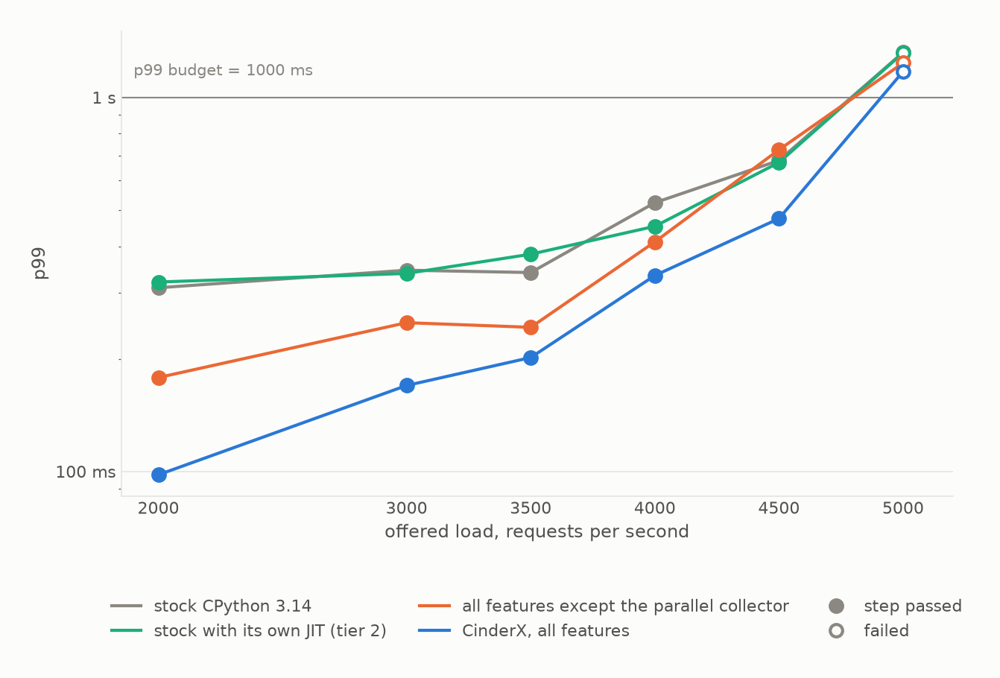

Up to 4,000, both CinderX lines perform below both stock options, and the order among them is the same as during the pauses. At 4,500, the stock version without an overclocker breaks out ahead, and at 5,000, all four fail to meet the budget: at that point, it's a matter of order of performance rather than overclocking.

The variation between runs at the capacity boundary is significant. Therefore, in the second graph, each configuration is represented not by a single number but by a range from the best run to the worst.

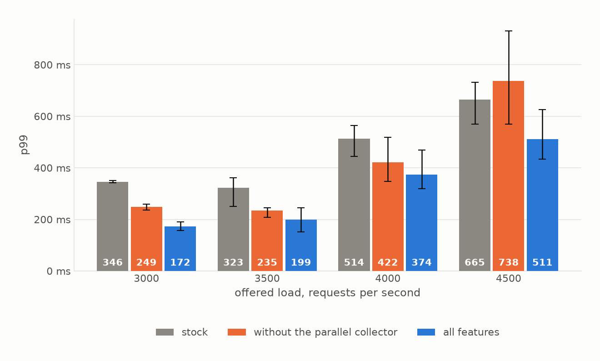

The difference between the baseline and the full set is clear in two out of four runs: 346 ms versus 172 at 3,000, and 323 versus 199 at 3,500, the ranges don't overlap there. Splitting the freeze and the compiler within CinderX only works at 3,000, with 249 versus 172. There's nothing more to say: at 4,000, the ranges overlap, and at 4,500, we've reached the capacity limit, where the spread stretches to half a second and covers all three configurations.

That's why we need to measure the pause itself: in that case, those two steps are separated in each set, rather than in a single serve out of four.

The numbers match the micro-measurement. A full collection on a heap like that takes 127 ms sequentially and 77 ms across the four threads the service uses, that is, 1.66 times faster. Under load, the same step yields a factor of 1.48 in the service.

---

## What does this imply?

There was exactly one way to improve performance: a typed graph traversal kernel under JIT, with 250 requests per second compared to 140 for the stock implementation. Nothing enabled via flags made a difference, the stock implementation, the stock implementation with Tier 2, and CinderX with all features enabled all yielded the same 140.

**Types and JIT only work together.** Types without JIT result in a 3.4-fold performance hit: 172 ns per iteration versus 50.9 ns for the standard ``int``. JIT without types speeds up the bytecode, but this had no effect on the staircase test. Together: 0.676 ns.

**Porting the code back from C to Python costs more than the benefits of typing.** The typed embedding scan itself became fifty-eight times faster, while the endpoint lost nine times its capacity: before the rewrite, the same operation was performed in NumPy and cost almost nothing.

**The flags don't affect memory capacity. They shorten the pauses.** On two out of three threads, this resulted in exactly zero: everything these endpoints read is loaded before the fork. On the third endpoint, which builds its cache directly in the worker, the pause was reduced from 269 ms to 103.

**The parallel garbage collector needs objects with a hundred references and a heap built after the fork.** With three references, it performs worse regardless of the number of threads.

**Estimate the proportion of bytecode before you begin.** If the service is a wrapper around NumPy, a database driver, and pydantic, the ceiling is known in advance and equals zero. If it involves iterating through structures and business rules in pure Python, the ceiling is double that. The profiler answers this question immediately, and the port to Static Python is the entire module: data representation, signatures, every counter, and every constant.

And a separate note about the measurements themselves. Any JIT measurement via `force_compile` relies on a single check: how many calls were sent to the interpreter. Until you perform that check, `is_jit_compiled()` will return `True` and the function being executed by the interpreter.

---

*The measurement code, raw results, and scripts for generating graphs are available in the repository attached to this article. Each figure mentioned in the text corresponds to a results file.*
