# Ускорение Python-сервиса с CinderX: JIT и статическая типизация

У любого ускорителя Python есть число: во сколько раз он быстрее. Меряют его на ядрах - сортировка, обход дерева, арифметика в цикле. Сервис устроен не так: обработчик ходит в базу, считает в numpy, сериализует ответ, и байткода, к которому это число применимо, в нём может почти не остаться. CinderX ускоряет байткод, и за пределы байткода это число не распространяется. Доля байткода в вашем сервисе - свойство вашего кода, а не расширения, и пока она не посчитана, «ставить или нет» решается угадыванием.

---

## Что такое CinderX

CinderX - расширение к CPython: бинарный пакет, который ставится в существующий интерпретатор. Он подменяет собой frame evaluator (функцию, которую CPython зовёт на исполнение каждого кадра), и дальше исполнение идёт через него.

Внутри:

- **JIT** - компилирует код-объект целиком в машинный код.
- **Static Python** - отдельный компилятор типизированного подмножества Python. Порождает собственные опкоды, которые JIT опускает дальше в машинный код.
- **Параллельный сборщик мусора** - распараллеливает две фазы сборки, включается вызовом.
- **Облегчённые фреймы** - в скомпилированном кадре заполняется только то подмножество полей, которое нужно самому машинному коду. Остальное достраивается, если рантайм запросит настоящий кадр. Работают вместе с JIT.
- **Библиотечные примитивы** - типизированные контейнеры и примитивные аналоги встроенных функций.

---

## JIT

В стоковом CPython 3.14 JIT уже есть: `--enable-experimental-jit` из PEP 744, он же tier 2. Поэтому вопрос стоит иначе: зачем ещё один.

### Это два противоположных компилятора

| | CinderX | CPython 3.14, tier 2 |
|---|---|---|
| единица компиляции | код-объект целиком | трасса из uop'ов, до 800 штук |
| что запускает компиляцию | вызов функции: счётчик, jit-список или `force_compile` | обратный переход, счётчик обратного отсчёта с 4095 |
| промежуточное представление | HIR, затем LIR, оба в SSA, HIR типизирован | нет - линейная трасса uop'ов |
| откуда берётся машинный код | генерируется в рантайме через asmjit | `memcpy` заранее собранных трафаретов плюс патч дырок |
| распределение регистров | linear scan по SSA с расщеплением интервалов | **нет** |
| где живут промежуточные значения | в машинных регистрах | на стеке кадра, в памяти |
| инлайнинг | по HIR, бюджет 2000 опкодов | проекцией трассы сквозь до 5 кадров |
| подсчёт ссылок | отдельный проход компилятора | как в интерпретаторе |
| что нужно для сборки | ничего | LLVM 19, только clang |

### CPython: копирование и заплатки

Идея copy-and-patch в том, чтобы вообще не иметь компилятора в рантайме.

В дереве CPython лежит файл `Tools/jit/template.c`. Это тело **одного** uop'а (микрооперации, на которые разложен байткод), обёрнутое в функцию с сигнатурой `(frame, stack_pointer, tstate)`. Всё, что в рантайме будет разным, объявлено дырками с говорящими именами: `_JIT_OPARG`, `_JIT_OPERAND0`, `_JIT_TARGET`, `_JIT_CONTINUE`.

На этапе сборки CPython clang компилирует этот шаблон по разу на каждый uop и складывает получившиеся куски машинного кода в таблицу трафаретов. Отсюда и требование LLVM 19 с clang: шаблон опирается на `musttail` - гарантированные хвостовые вызовы, которых нет у GCC.

В рантайме `_PyJIT_Compile` получает трассу и делает ровно то, что написано на упаковке: идёт по ней, копирует нужный трафарет в исполняемую память и заполняет дырки настоящими значениями. Ни разбора, ни анализа, ни выбора инструкций - поэтому она и дешёвая.

Склейка держится на хвостовых вызовах. Каждый трафарет заканчивается так:

```c
#define PATCH_JUMP(ALIAS)                                                \
do {                                                                     \
    PATCH_VALUE(jit_func_preserve_none, jump, ALIAS);                    \
    __attribute__((musttail)) return jump(frame, stack_pointer, tstate); \
} while (0)
```

То есть трасса - это цепочка функций, каждая из которых прыгает в следующую, не наращивая стек. Соглашение о вызовах `preserve_none` позволяет держать `frame`, `stack_pointer` и `tstate` в регистрах по всей цепочке.

**Значение из одного uop'а в другой передаётся через память.** Раз каждый uop - независимо скомпилированный кусок, у компилятора нет никакой возможности передать значение из одного uop'а в другой через регистр. Значение, которое произвёл `_LOAD_FAST`, попадает на стек значений кадра (в память), откуда его и заберёт следующий uop. Промежуточного представления нет, распределять нечего.

Что copy-and-patch даёт: исчезает цикл диспетчеризации со своим `switch` и непредсказуемым переходом. Плюс абстрактный интерпретатор в `Python/optimizer_analysis.c` прогоняет по трассе анализ потока данных и выкидывает то, что доказуемо избыточно - повторные проверки версий типов.

Чего он не даёт: у соседних uop'ов нет общего регистра, промежуточные значения ходят через стек кадра в памяти, и операции над счётчиком ссылок не переставляются по живости. Со счётчиками анализ делает единственное: берёт заимствующий вариант загрузки константы, если константа бессмертна.

Трасса собирается так. `translate_bytecode_to_trace` проецирует её вдоль горячего пути от обратного перехода, и на каждой развилке смотрит историю ветвления. Уверенность стартует с 1000 и умножается на долю совпавших переходов. Если она падает ниже 333 - проекция обрывается. Трасса не длиннее 800 uop'ов, вглубь - не больше пяти кадров.

Целиком путь выглядит так - цепочка стадий, и на каждой видно, во что превратился счётный цикл из семи строк:

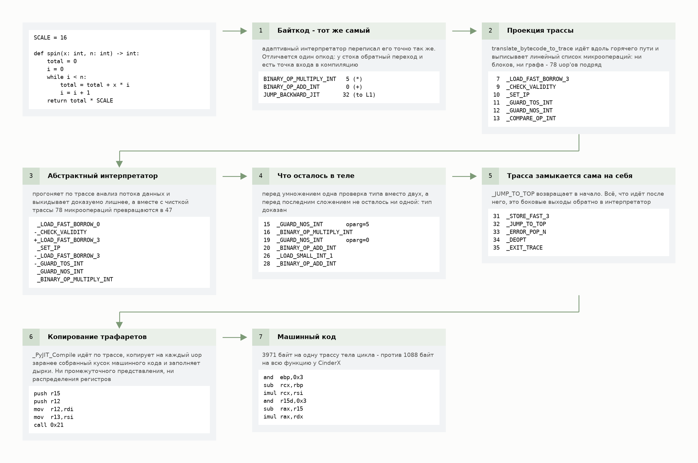

Обратите внимание на третий и четвёртый шаги. После анализа в трассе остаётся 47 микроопераций из 78. Больше половины снятого - `_SET_IP` и `_CHECK_VALIDITY`, служебная синхронизация состояния, и убирает их отдельный проход по готовой трассе, а не сам абстрактный интерпретатор. Но заодно он доказывает типы: перед умножением остаётся одна проверка вместо двух, а перед последним сложением - ни одной.

### CinderX: настоящий метод-компилятор

Единица - код-объект целиком: функция, метод, лямбда. Не трасса, поэтому ветвления не нужно угадывать: компилируются все.

**Разрешение имён и типов (`Preloader`).** Отдельная фаза, и единственное место во всём конвейере, где разрешено исполнять Python. Она заранее разрешает глобальные имена под `LOAD_GLOBAL`, типы и цели вызовов для опкодов Static Python. Любое исполнение Python во время компиляции может сломать допущения компилятора. Поэтому эта фаза идёт последовательно под GIL, а дальше воркеры компилируют параллельно.

**Байткод в HIR.** Виртуальная машина CPython стековая, и байткод под неё написан соответственно: операнды инструкция берёт с вершины стека, а результат кладёт туда же, так что у значений нет имён. Чтобы убрать из кода лишнюю работу, надо сначала доказать, что она лишняя, а любое такое доказательство упирается в вопрос «откуда взялось это значение и кто им пользуется». К стеку такой вопрос не задать. Поэтому компилятор первым делом переписывает байткод в форму, где у каждого значения есть имя, у каждой инструкции явные входы и выходы, а у каждого значения ещё и тип. Тип здесь так же обязателен, как имя: работа, которую JIT убирает (проверки, распаковка, счётчики ссылок), существует только потому, что тип неизвестен. Это и есть HIR.

Строится он не из чистого байткода, а из байткода **вместе с тем, что оставил после себя адаптивный интерпретатор CPython.** Когда интерпретатор видит, что `a + b` всегда складывает целые, он переписывает опкод на специализированный `BINARY_OP_ADD_INT`. Построитель HIR читает именно этот, специализированный опкод, и превращает его в проверку типа:

```cpp
case BINARY_OP_ADD_INT:
case BINARY_OP_MULTIPLY_INT:
case BINARY_OP_SUBTRACT_INT:
  tc.emit<GuardType>(left, TLongExact, left, tc.frame);
  tc.emit<GuardType>(right, TLongExact, right, tc.frame);
  break;
```

Таких специализаций построитель HIR узнаёт двадцать две: арифметика над `int`, `float` и строками, индексация списков, кортежей и словарей, сравнения, распаковка последовательностей, `LOAD_ATTR_MODULE`. Остальные специализированные опкоды он читает как общие: в HIR попадают только те наблюдения, которые он умеет превратить в охранную проверку - `GuardType` из листинга выше.

Отсюда то, что дальше видно на графиках: **JIT компилирует то, что интерпретатор успел увидеть.** Функция, скомпилированная до первого исполнения, не даёт ему ни одной такой проверки: HIR построится без единого `GuardType`.

**Проходы по HIR.** После построения - перевод в SSA и протяжка типов. В SSA каждое имя присваивается ровно один раз, поэтому «откуда взялось значение» - один переход по ссылке, а не поиск по графу. На этом держатся все проходы ниже. Дальше конвейер оптимизаций: упрощение, устранение динамических сравнений, снятие лишних проверок типа, устранение phi-узлов, инлайнинг, устранение лишних загрузок методов, чистка графа потока управления.

Инлайнер работает по бюджету: стоимость функции - число настоящих опкодов, лимит по умолчанию 2000. Набрали бюджет, дальше не инлайним.

Почти в самом конце идёт **`RefcountInsertion`**. Так поздно - потому что каждый предыдущий проход двигает и выбрасывает инструкции: расставь счётчики раньше, и корректность пришлось бы поддерживать во всех этих проходах. Подсчёт ссылок в CinderX не зашит в опкоды: компилятор расставляет его сам, по метаданным о том, как каждая HIR-инструкция обращается со ссылками и памятью. Делается это ради корректности. Зато компилятор видит `incref`/`decref` как обычные инструкции и может сокращать их пары.

**HIR в LIR и машинный код.** По HIR нельзя распределить регистры: он говорит про питоновские операции (сложить, проверить тип, позвать), а распределитель работает с машинными инструкциями и их ограничениями. Нужна форма, где инструкции уже машинные, а регистров ещё сколько угодно: тогда распределителю есть что раскладывать. Это LIR - тонкая абстракция над ассемблером, тоже в SSA. Распределитель раздаёт регистры за один линейный проход по функции, разрезая при нехватке интервалы жизни значений на части. Дальше x64 генерируется через asmjit.

**Деоптимизация.** Раз код опирается на охранные проверки, нужен выход. Состояние интерпретатора представлено в HIR объектами `FrameState` - смещение текущего опкода, содержимое стека операндов, стек блоков. Инструкция `Snapshot` фиксирует его в точке программы. `Guard` берёт булев операнд и наследует `FrameState` ближайшего доминирующего снимка.

В машинном коде `Guard` - это сравнение и переход на заглушку. Заглушек три уровня: по одной на каждую проверку (кладёт индекс метаданных), по одной на функцию (подставляет адрес рантайма и адрес настоящего эпилога) и один трамплин на рантайм - он сбрасывает пятнадцать регистров на стек, зовёт `prepareForDeopt`, чтобы по `FrameState` собрать `_PyInterpreterFrame`, и отдаёт управление интерпретатору через `resumeInInterpreter`.

Путь компиляции целиком, на той же функции:

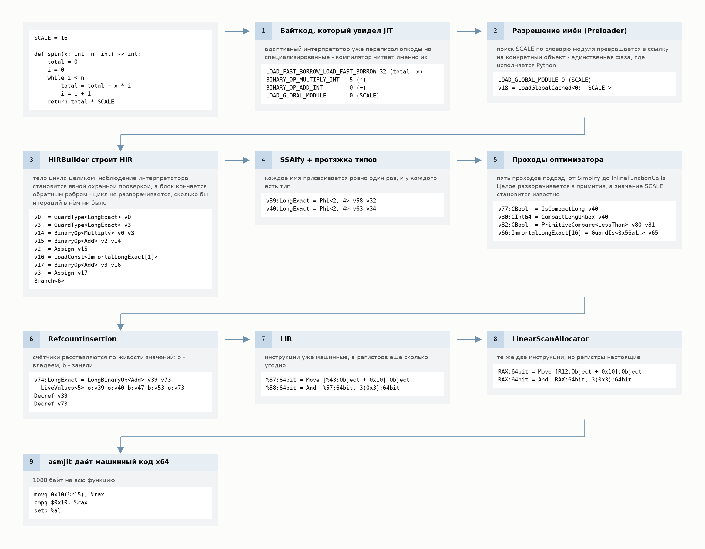

А это то, что происходит, когда охранная проверка не сошлась - от двух инструкций в теле функции до возврата в интерпретатор:

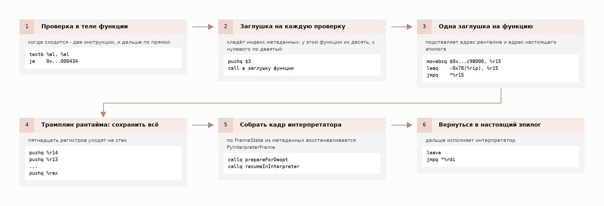

Пока проверка сходится, она стоит `testb` и непрошедший переход. Всё остальное на этой схеме исполняется только в тот момент, когда наблюдение интерпретатора оказалось неверным.

### Что каждый из них убирает

Разница в том, какую задачу каждый решает.

Copy-and-patch убирает диспетчеризацию. Если ваша программа упирается в цикл интерпретатора - она выиграет. Если она упирается в трафик в память, аллокацию объектов и подсчёт ссылок - выигрыша не будет: всё это осталось таким же.

CinderX может держать значения в регистрах и сокращать подсчёт ссылок, но только там, где знает типы. А знает он только то, что успел наблюдать интерпретатор: `int`, `float`, `str`, список, кортеж, словарь. Для поля вашей структуры у него нет смещения - только инлайн-кеш.

### Где именно включается компилятор

Чтобы увидеть сам момент, а не среднее по прогону, я записал каждый из четырёхсот последовательных вызовов одной функции - «Жизни» на поле 96×96.

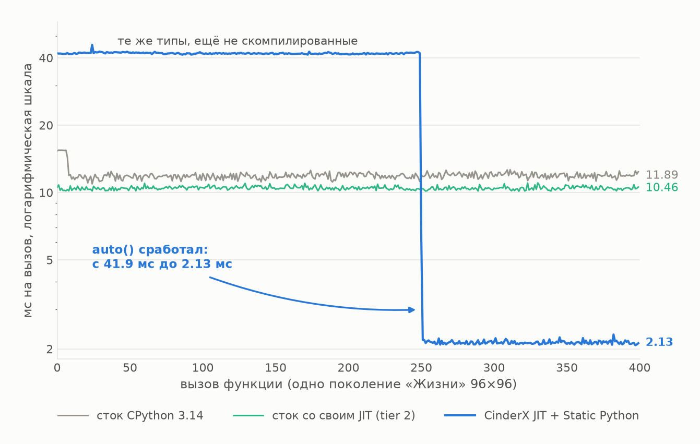

Синяя линия: двести пятьдесят вызовов функция идёт по 41.9 мс, потом счётчик доходит до порога. На следующем вызове идёт компиляция, он стоит 6.2 мс, а дальше полка держится на 2.13 мс. Обрыв в девятнадцать раз, ступенькой, внутри одного процесса. Её левая половина - это и есть типы без компиляции: аннотации в коде уже стоят, а порог ещё не достигнут.

Две стоковые линии идут рядом. Сток CPython 3.14 - 11.89 мс, он же с tier 2 (`--enable-experimental-jit`) - 10.46 мс, то есть собственный JIT CPython даёт здесь 1.14 раза. Внутри одного бинарника разрыв меньше: с `PYTHON_JIT=0` сборка с tier 2 идёт 11.54 мс, то есть 1.10 раза.

Ступеньки у tier 2 на графике нет вовсе. Его порог считается по обратным переходам, а внутренний цикл по 9216 клеткам добирает свои 4095 за первый же вызов, так что зелёная линия идёт ниже серой с самого начала. Видна зато другая ступенька, и только у стока: первые семь вызовов идут по 15.4 мс, потому что адаптивный интерпретатор ещё переписывает опкоды на специализированные. И проверить, что tier 2 скомпилировал именно вашу функцию, нечем: интроспекции по функциям у него нет вовсе. `sys._jit.is_enabled()` отвечает про настройку процесса, `is_available()` - про сборку, а `is_active()` - про текущий кадр в момент вызова, но не про функцию.

### Деоптимизация, которой вы не ждёте

Деоптимизация, о которой помнят, это подмешанные типы: скомпилировали на целых, прислали `Decimal`, кадр ушёл в интерпретатор. Она предсказуема и лечится дисциплиной на входе. Дорого обходится другая - та, где охранной проверки вы не ждёте вовсе, потому что код не ваш.

`__exit__` у генераторного контекстного менеджера делает `next(self.gen)` внутри `try`, ловит `StopIteration` - и каждый выход из `with` даёт деоптимизацию с причиной `UnhandledException`. Не одну на функцию, а на каждый проход через блок.

В форке это не чинится: `contextlib.py` побайтово совпадает со стоковым, никакой подмены `__exit__` в дереве нет. То есть на коде, который вы не писали и не можете поправить, включённый компилятор выходит из скомпилированного кадра столько раз, сколько у вас выполнено блоков `with`.

Выход в диалекте есть, но не в `contextlib`. В `__static__` лежит свой `ContextDecorator` - обычный класс, без генератора, и компилятор знает его по имени: декоратор он выбрасывает совсем, а тело декорируемой функции переписывает в `with <декоратор>._recreate_cm():` прямо внутри неё. Ни обёртки, ни лишнего кадра, ни единой деоптимизации. Работает это и из нетипизированного модуля: там ту же роль играет C-реализация входа и выхода с кешированием по версии типа.

### У корутины JIT забирает только тело

Корутина для компилятора - обычный код-объект: `force_compile` на `async def` отвечает `True`, компиляция занимает микросекунду и даёт 920 байт машинного кода, а за две тысячи замеренных вызовов в интерпретатор не уходит ни один. Никакого особого отношения к `async` у компилятора нет.

В `await f(x)` оплачиваются три части: создание объекта корутины, исполнение её тела и, если она действительно приостановится, проход через цикл событий. Скомпилировать можно только вторую.

| нс на один вызов | сток | сток, tier 2 | CinderX, JIT выключен | CinderX + JIT | Static Python + JIT |
|---|---|---|---|---|---|
| обычная функция, тело 64 итерации | 2525 | 2024 | 2909 | 1975 | - |
| `await`, пустое тело | 111 | 113 | 185 | 187 | 231 |
| `await`, тело 8 итераций | 396 | 375 | 528 | 405 | 247 |
| `await`, тело 64 итерации | 2567 | 2102 | 2986 | 2059 | 340 |
| `await` с приостановкой | 2393 | 2474 | 2970 | 3002 | 2999 |

Пустая корутина стоит 185 нс до компиляции и 187 после. Приостановка - 2970 и 3002. И то и другое код asyncio на C, байткода под компиляцию там нет, и включение JIT обе строчки скорее чуть портит.

Тело он берёт: 2986 против 2059 нс, в 1.45 раза. Обычная функция с тем же телом выигрывает больше, в 1.47 раза, и чем легче тело, тем заметнее разрыв: на восьми итерациях у корутины 1.30, у функции 1.66. Съедает разницу та самая фиксированная часть, которой компилятор не касается.

Против стокового CPython картина хуже. На теле в 64 итерации JIT отыгрывает 1.25 раза: часть выигрыша уходит на то, чтобы вернуть потраченное самим рантаймом, который без компилятора дороже стока на каждой строчке таблицы. А на пустой корутине надбавка так и остаётся: 111 нс у стока против 187 с включённым компилятором. Со стоком, собранным со своим JIT, разрыва не остаётся совсем: на теле в 64 итерации 2102 против 2059 нс, на восьми tier 2 и вовсе впереди - 375 против 405.

Разница два процента: на нетипизированной корутине с горячим циклом встроенный в сток компилятор догоняет CinderX вплотную, бесплатно и без единой правки в коде.

Без JIT типизированная корутина - 539 нс на пустом теле и 11.3 мкс на теле в 64 итерации, то есть в 2.9 и в 3.8 раза хуже нетипизированной: тот же регресс, что и везде в этой главе. Под JIT - 231 и 340 нс. Шестьдесят четыре итерации типизированного тела стоят 109 нс, по 1.7 нс на итерацию, а обвязка, которая это тело запускает, стоит 231 нс, вдвое дороже собственно работы, и эта обвязка лежит не в байткоде.

На теле в 64 итерации типизированная корутина быстрее стоковой в 7.5 раза, на восьми - в 1.6, а на пустой она вдвое медленнее: 231 нс против 111. Типы начинают отбивать фиксированную надбавку примерно с третьей итерации тела.

Последняя строка таблицы показывает предел: один `await`, действительно отдающий управление циклу событий, стоит около 2.6 мкс сверх тела - больше, чем семь полных типизированных вызовов с телом в 64 итерации. Обработчик, который ходит в базу, приостанавливается на каждом запросе, и типизация ядра уменьшает там слагаемое, которого и так почти нет.

Одна оговорка, на которую вы налетите в первый же час. Примитивный тип возврата у `async def` под JIT ломает функцию молча: вызов возвращает не корутину, а указатель, упакованный в `int`, и `await` падает с `TypeError: 'int' object can't be awaited`.

| тип возврата | JIT | вызов возвращает | `await` |
|---|---|---|---|
| `int64` | выключен | coroutine | 84 |
| `int64` | включён | int | TypeError |
| `int` | выключен | coroutine | 84 |
| `int` | включён | coroutine | 84 |

Если такой `await` стоит внутри типизированного модуля и модуль компилируется, процесс падает на ассерте самого компилятора: `Only primitive numeric types should be boxed`. Лечится боксированным типом возврата - объявить `int` вместо `int64` и поставить `box()` на выходе. Примитивы в аргументах при этом остаются примитивами.

### Режимы компиляции и флаги

Режимы: `auto()` по счётчику вызовов, `compile_after_n_calls(n)` включая ноль, `force_compile` и `lazy_compile` поштучно, `precompile_all(workers)` пачкой. Что компилировать - jit-списками, в том числе файлом с wildcards.

Всё то же выставляется флагами `-X cinderx-jit-*`, и почти у каждого есть зеркальная переменная окружения `CINDERX_JIT_*`. В контейнере JIT настраивается окружением, без правок кода. Полный список - пятьдесят девять таких флагов, с описаниями - печатает сам рантайм:

```
python -X cinderx-jit-help -c 'import cinderx; cinderx.init()'
```

`cinderx.set_adaptive_delay(n)` и `cinderx.delay_adaptive(bool)` лежат не в jit-модуле, а в самом `cinderx`. Они двигают порог, после которого адаптивный интерпретатор берётся специализировать опкоды, и позволяют отложить специализацию до того, как функция станет горячей. На этой сборке порог равен восьмидесяти. Рычаг маленький, но он про то же: компилировать до того, как интерпретатор специализировал опкоды, значит компилировать без проверок типа - а вместе с ними и без того, что на этих проверках строится. На счётном ядре это стоит сорока процентов: 6.09 мс без прогрева против 4.35 после одного.

Компиляция пачкой: 200 функций поштучно через `force_compile` - 368 мс, те же 200 через `precompile_all(workers=4)` - 88 мс, вчетверо быстрее за счёт параллельной фазы после разрешения имён.

### Чему из диагностики нельзя верить

JIT показывает, что скомпилировано, за сколько, сколько байт вышло и что увидел компилятор, вплоть до дизассемблера. Часть этого отвечает не на тот вопрос, который вы задаёте: `is_enabled()` говорит про инициализацию подсистемы, а не про ваш код, а `is_static_module(mod)` надо брать из `__static__`, а не из jit-модуля, иначе без установленного загрузчика модуль с `import __static__` исполнится как обычный Python и вы об этом не узнаете.

И главное: **точка вызова, успевшая дважды позвать функцию, после `force_compile()` продолжает звать интерпретатор.** При этом `is_jit_compiled()` отвечает `True`, `get_compiled_size()` отдаёт 2408 байт, дизассемблер печатает код - и этот код при одном прогреве и при двух совпадает инструкция в инструкцию.

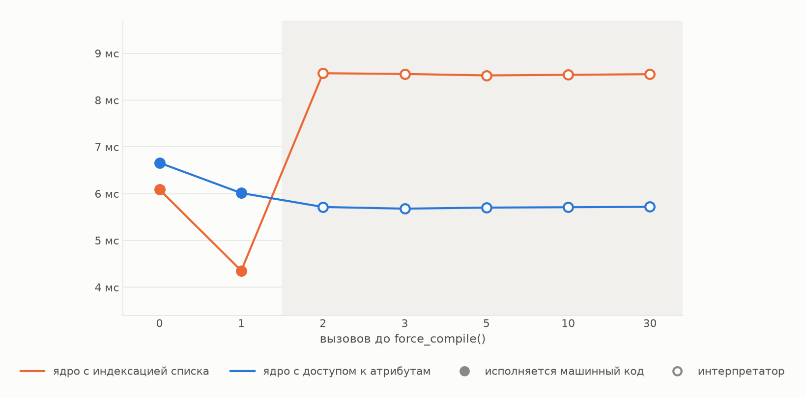

Без прогрева 6.09 мс, после одного - 4.35, после двух - 8.57 и намертво, сколько дальше ни грей. Полка равна скорости чистого интерпретатора. Поштучно это видно по `count_interpreted_calls`: при одном прогреве в интерпретатор ушло ноль вызовов из пятнадцати, при двух - пятнадцать из пятнадцати. `auto()` и `compile_after_n_calls(n)` этим не страдают, Static Python тоже: типизированные функции ходят своим путём вызова, и прогрев там не значит ничего.

Если вы меряете JIT через `force_compile`, единственный свидетель - `count_interpreted_calls`. Всё остальное описывает артефакт компиляции, а не то, что исполняется.

## Static Python

Там, где инлайн-кешей мало или они полиморфны, аннотации дают компилятору то, чего он не может увидеть сам.

### Специализированные опкоды вместо поиска атрибутов

Отдельный компилятор читает аннотации и порождает специализированные опкоды: доступ к полю по вычисленному смещению вместо поиска атрибута, прямой вызов вместо разрешения имени, примитивная арифметика вместо `PyNumber_*`.

Проверки стоят на границе, а не везде. На импорте компилятор отвергает модуль, и тот просто не загрузится. В рантайме проверяются пролог аргументов, явные касты, возвращаемое значение переопределяемых методов и питоновские входы в контейнеры. Внутри периметра доступ к полю - сырое смещение, без поиска атрибута и без проверки типа.

### Примитивы, контейнеры и операции границы

Примитивы: `int8`…`int64`, `uint8`…`uint64`, `cbool`, `char`, `double`, `size_t`. Контейнеры с проверенным типом элемента: `Array[int64]`, `CheckedDict`, `CheckedList`. Операции границы: `box`/`unbox` и `cast` - в отличие от `typing.cast`, с настоящей проверкой в рантайме. Примитивные версии встроенных: `clen`, `crange`. Свои декораторы: `@inline`, `@native` и `@dynamic_return` - последний снимает рантайм-проверку возвращаемого типа: аннотация остаётся для читателя и для проверяльщика типов, а рантайм её больше не сверяет. А `final` из `__static__` - это буквально реэкспорт `typing.final`. Новым он не становится, но перестаёт быть пожеланием: компилятор начинает его проверять и на основании него звать метод напрямую, без виртуального диспетча.

**У примитива фиксированная ширина.** Питоновское целое не переполняется никогда, примитив переполняется на каждой из них:

| выражение | значение |
|---|---|
| `int8` 127 + 1 | −128 |
| `uint8` 255 + 1 | 0 |
| `int16` 32767 + 1 | −32768 |
| `int32` 2147483647 + 1 | −2147483648 |
| `uint64` 0 − 1 | 18446744073709551615 |
| `int8(int64(300))` - сужение | 44 |

Ни одна строка не бросает исключения. Счётчик, хеш или произведение, которое в обычном Python уезжало в длинную арифметику, после порта свернётся по модулю.

**Как выглядит порт.** Вот ядро обхода графа из сервиса - на нём же построены замеры. Было:

```python
def walk(indptr, indices, weights, seeds, scores, touched) -> int:
    n_touched = 0
    for seed in seeds:
        p = indptr[seed]
        pe = indptr[seed + 1]
        while p < pe:
            nb = indices[p]
            w = weights[p]
            prev = scores[nb]
            if prev == 0:
                touched[n_touched] = nb
                n_touched += 1
            scores[nb] = prev + w * DECAY_FIRST
```

Стало:

```python
def walk(indptr: Array[int64], indices: Array[int64], weights: Array[int64],
         seeds: Array[int64], n_seeds: int64,
         scores: Array[int64], touched: Array[int64]) -> int64:
    n_touched: int64 = 0
    s: int64 = 0
    while s < n_seeds:
        seed: int64 = seeds[s]
        p: int64 = indptr[seed]
        pe: int64 = indptr[seed + 1]
        while p < pe:
            nb: int64 = indices[p]
            w: int64 = weights[p]
            prev: int64 = scores[nb]
            if prev == 0:
                touched[n_touched] = nb
                n_touched = n_touched + 1
            acc: int64 = prev + w * 16
            scores[nb] = acc
```

Алгоритм не изменился ни на строчку. Аннотациями при этом дело не обошлось: изменились представление данных, сигнатура, объявление счётчиков и именованные константы.

**Представление данных.** Списки стали `Array[int64]`. Заполнять их приходится самому, поэлементной копией: готового конструктора из списка в диалекте нет, а копия проходит по всему входу до того, как начнётся типизированная работа.

**Сигнатура.** Буферы под результат аллоцирует вызывающий: типизированная версия отбора кандидатов заполняет переданные `out_ids`/`out_scores` и возвращает счётчик, а питоновские кортежи из них собирает отдельная `boxed_pairs`. Упаковка платится один раз за выданный топ, а не за каждого тронутого кандидата.

**Счётчики приходится объявлять.** Значение, пришедшее из `Array[int64]`, типизируется само: `nb = indices[p]` - это `int64` без всякой аннотации. А вот счётчик, заведённый литералом, не соберётся:

```python
total = 0
for i in crange(n):        # i: int64
    total = total + i
# TypedSyntaxError: invalid union type Union[int64, Literal[0]];
#                   unions cannot include primitive types
```

Объявлять приходится всё, что начинается с нуля: каждый счётчик и каждую сумму.

**Именованные константы исчезли.** Там, где в обычной версии `w * DECAY_FIRST`, в типизированной - `w * 16`. Константа модуля не смешивается с примитивом ни в каком виде, а объявить её примитивом нельзя: в области видимости модуля примитивы запрещены.

Портированный модуль вдобавок перестаёт быть изменяемым. После импорта заморожены и модуль, и объявленные в нём классы: присваивание атрибуту модуля даёт `AttributeError: cannot modify attribute ... of strict module`, добавление метода классу - `TypeError: cannot set ... attribute of immutable type ...`. Заморозка происходит в конце тела модуля, поэтому внутри него присваивание классу законно, а снаружи уже нет. Наследоваться от замороженного класса можно, подкласс остаётся обычным. Соседние нетипизированные модули и стандартная библиотека не затрагиваются.

Для тестов это значит, что `mock.patch` по такому модулю не работает. Штатный выход - собрать загрузчик с `enable_patching=True` и пользоваться `StrictModuleTestingPatchProxy`.

Ещё одно обнаруживается не сразу: `functools.cached_property` в типизированном модуле перестаёт работать вовсе. Классы слотированы, словаря экземпляра нет, и дескриптору некуда положить значение - `TypeError: No '__dict__' attribute on 'S' instance to cache 'x' property`. Заменой служит `cached_property` из `cinderx`: компилятор выносит тело в отдельный метод, дописывает поле в слоты и читает его прямым смещением. Под JIT это вдобавок примерно на треть быстрее стандартного, и быстрее именно за счёт слота: та же реализация в обычном классе от `functools` неотличима.

Наблюдаемое поведение тоже меняется, и об этом лучше узнать заранее: классы получают слоты автоматически (значит `AttributeError` там, где раньше работало, а слабые ссылки надо разрешать декоратором `@allow_weakrefs`, который дописывает `__weakref__` в слоты), именованные аргументы превращаются в позиционные там, где компилятор разрешил вызов статически (значит `mock.call_args` покажет позиционные), множественное наследование с раскладкой падает - два статических класса не соединить, `TypeError: multiple bases have instance lay-out conflict`, и лечится это декоратором `@mixin`, который выводит класс из статической компиляции целиком.

### Обычные приёмы, которые здесь не работают

Всё, что в таблице, в обычном Python пишут не задумываясь. Компилятор отвергает это на импорте, и модуль падает с `StrictModuleError` - текст диагностики в правом столбце. Исключение одно: `class C(A, B)` он пропускает, и падение приходит уже при создании класса.

| что пишете | что вы получите |
|---|---|
| `for i in range(n): a[i] = i` | `type mismatch: dynamic cannot be assigned to int64` |
| `SHIFT: int64 = 12` в модуле | `cannot use primitives in global or closure scope` |
| `SHIFT: Final[int] = 6`, затем `w >> SHIFT` | `cannot right shift int64 and int` |
| `print(n)`, где `n: int64` | `Call argument cannot be a primitive` |
| `class C(A, B)`, у обоих есть поля | `TypeError: multiple bases have instance lay-out conflict` |
| атрибут и метод с одним именем | `function conflicts with other member attr` |
| `x: int` объявлен в обеих ветках `if` | `Cannot redefine local variable x` |
| `a == b or x > y` - `cbool` рядом с динамическим значением | `invalid union type Union[cbool, dynamic]` |
| переопределение `@final`-метода | `Cannot assign to a Final attribute` |

Цикл по индексу и именованная константа встречаются в любом счётном коде, поэтому их стоит разобрать подробнее.

Цикл по индексу:

```python
for i in range(n):
    a[i] = i
# TypedSyntaxError: type mismatch: dynamic cannot be assigned to int64
```

`range()` отдаёт `dynamic`. Преобразование `dynamic` в `int` разрешено как неявный проверяемый каст, `dynamic` в `int64` - нет. Заменять приходится на `crange`, примитивный аналог, либо на явный `while` со счётчиком. Итерация по самому `Array[int64]` при этом типизирована: переменная цикла получает тип `int64`, конверсия не нужна. По обычному списку она снова `dynamic`, и каждый элемент придётся пропускать через `int64(v)`.

Именованная константа:

```python
SHIFT: Final[int] = 6
acc: int64 = (w * w2) >> SHIFT
# TypedSyntaxError: cannot right shift int64 and int
```

Константа модуля не участвует в примитивной арифметике. Ни как `Final[int]`, ни как обычная глобальная: тогда диагностика просто меняется на `cannot right shift int64 and dynamic`. Объявить её примитивом тоже нельзя: примитивы запрещены в области видимости модуля. Остаётся конверсия на месте использования (`>> int64(SHIFT)`) или подъём в типизированную локальную в начале функции. Либо, как в ядрах этой статьи, раскрытие в литерал.

### Цена без JIT

Вот во что обходится одна итерация счётного цикла из двух сложений и сравнения, если менять только конфигурацию:

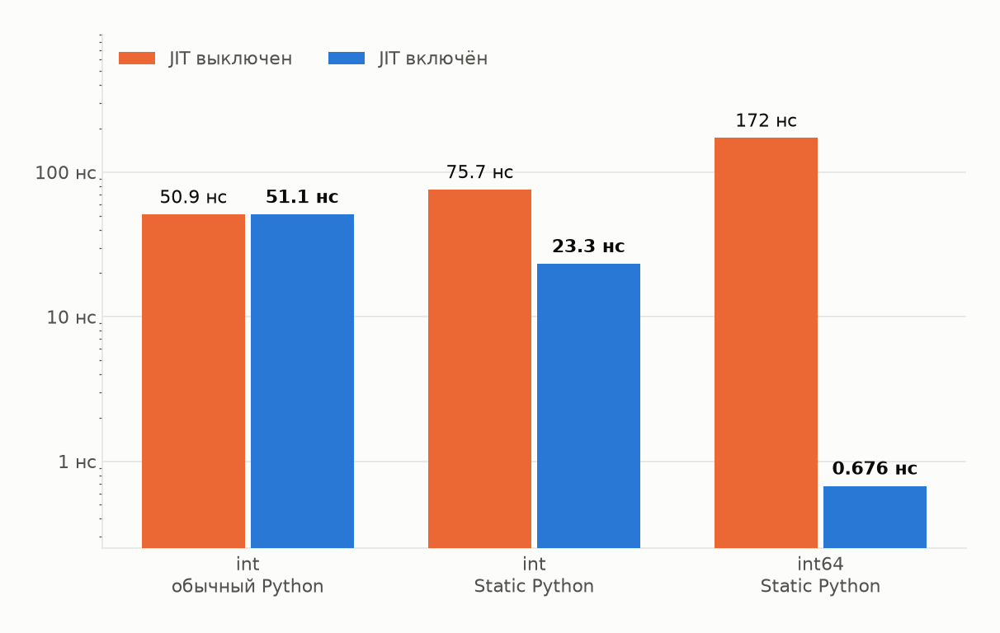

Обычный питоновский `int` - 50.9 нс. Тот же `int` в Static Python - 75.7 нс. `int64` в Static Python - **172 нс**, то есть в 3.4 раза хуже, чем то, с чего начали.

Включаем JIT, ничего больше не меняя: `int64` - **0.676 нс**. В 255 раз быстрее себя же без JIT и в 75 раз быстрее обычного `int`.

Семьдесят пять получается на лучшем случае. Стоит завести в тот же цикл зависимость по данным (`(s * 31 + i) & 1048575` вместо сложения) - выходит 2.53 нс, двадцать раз против обычного `int`. Разница в том, что цепочка с зависимостью по данным не раскладывается по регистрам так же свободно.

В интерпретаторе `int64` - это всё ещё `PyLong`. Опкод примитивной операции распаковывает оба операнда в машинное слово, делает над ними одну операцию на C и упаковывает результат обратно - в свежий `PyLong`, с аллокацией. Плюс `EXTENDED_OPCODE` - два диспетчера вместо одного. Объявив машинный тип, вы получили ту же работу плюс упаковку и распаковку вокруг неё. **Статические типы - это вход для JIT: без него машинного представления не возникает нигде.**

### Цена доступа к полю

Примитивную арифметику пишут редко, поля объектов - на каждом шагу, так что тот же вопрос стоит задать и про них.

| нс на операцию | сток | сток, tier 2 | CinderX + JIT | типы, JIT выключен | типы + JIT |
|---|---|---|---|---|---|
| чтение поля | 35.7 | 34.6 | **19.7** | 72.7 | **16.2** |
| чтение и запись | 73.0 | 65.1 | 51.4 | 115.9 | **44.4** |

Компилятору неоткуда узнать смещение поля вашего класса - он опирается на инлайн-кеш, который заводит сам и заполняет на первом промахе. Этого уже хватает, чтобы снять почти половину: 19.7 нс против 35.7 у стока. Типы дают то, чего кешем не добрать: смещение, известное на этапе компиляции. Это 16.2 нс, ещё пятая часть сверху. На паре «чтение и запись» обе прибавки те же, только мягче: 51.4 против 73.0 у стока и 44.4 с типами - на каждую итерацию там приходится ещё одно чтение и запись, и экономия растёт медленнее, чем сам объём работы.

А вот интерпретатор CinderX на чтении поля дороже стокового: 43.6 против 35.7. Без компилятора расширение здесь только мешает.

Типы без JIT - вдвое хуже стока, 72.7 против 35.7: тот же регресс, что и на арифметике. У типизированного класса поле лежит по вычисленному смещению, и в скомпилированном коде доступ к нему - одна инструкция загрузки. Проверка на NULL и подсчёт ссылок рядом с ней остаются.

### Цена границы

Периметр статического кода пересекается на каждом вызове ядра из обработчика, и там стоят все проверки:

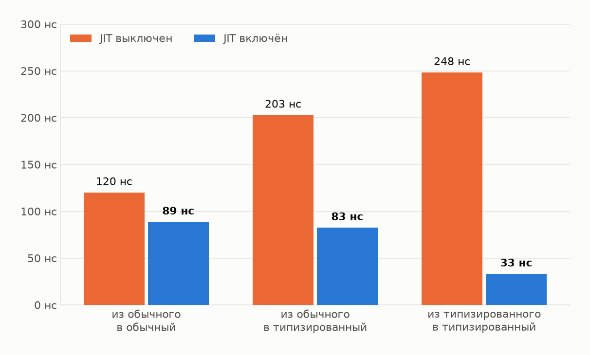

Без JIT переход в типизированный код дороже обычного: 203 нс против 120, в 1.7 раза. С JIT надбавка исчезает целиком - 83 нс против 89, то есть типизированный переход выходит даже чуть дешевле нетипизированного, и происходит это только вместе с компиляцией.

Третий столбик на графике измеряет другое. Там весь цикл живёт внутри статического периметра, и без JIT он платит за штраф статического интерпретатора из раздела про примитивы (248 нс), а с JIT компилируется целиком вместе с вызовом (33 нс). С первыми двумя столбиками его сравнивать нельзя, и в самом замере это записано отдельной пометкой.

---

## Библиотека: то, что убирает работу

Всё до сих пор ускоряло байткод. В расширении есть и другая половина - примитивы, которые уменьшают количество работы.

### Одно вычисление на сколько угодно ожидающих

`AsyncLazyValue` оборачивает корутину и даёт гарантию: сколько бы раз её ни ждали, тело исполнится один раз. Пятьдесят одновременных ожиданий одного и того же значения:

| | исполнений тела |
|---|---|
| пятьдесят раз вызвать корутину | 50 |
| один `AsyncLazyValue`, пятьдесят ожидающих | **1** |

Обойтись переменной тут нельзя: объект-корутина одноразовый, повторный `await` падает с `cannot reuse already awaited coroutine`. `AsyncLazyValue` хранит состояние и список ожидающих `Future`: первый `await` запускает вычисление, остальные встают в список, по завершении результат раздаётся всем разом.

| нс на одно ожидание | CinderX, JIT выключен | CinderX + JIT |
|---|---|---|
| `await` свежей корутины | 185 | 187 |
| `await` готового `AsyncLazyValue` | 123 | **45** |
| готовый `AsyncLazyValue` через `async_cached_property` | 128 | 69 |

Без JIT готовое значение дешевле свежего вызова в полтора раза, с JIT - вчетверо. Фиксированную цену обычного `await` компилятор не трогает вовсе, 185 и 187 нс, а путь через `AsyncLazyValue` сокращает со 123 до 45.

`async_cached_property` - та же вещь в форме свойства: первое чтение кладёт `AsyncLazyValue` в словарь экземпляра, дальше это обычный поиск атрибута. Двадцать пять наносекунд разницы под JIT и есть цена этого поиска поверх готового значения.

В стандартной библиотеке аналогов нет: `functools.cached_property` синхронный, асинхронного там не появилось.

---

## Процесс: память и форк

Иммортализация кучи и параллельный сборщик работают на уровне процесса и складываются в одну пре-форк последовательность.

### Память: иммортализация

`immortalize_heap()` устроен проще, чем звучит: он собирает мусор, зовёт `gc.freeze()` и проходит по получившемуся permanent generation, помечая бессмертным каждый объект и то, что тот отдаёт одним шагом `tp_traverse`. Транзитивного замыкания по графу нет: достаётся тому, что сборщик отслеживал, и его прямым ссылкам, плюс руками прописанным исключениям - содержимому словарей, константам и именам код-объектов. Счётчики ссылок у помеченного перестают меняться, значит после `fork()` эти страницы не должны копироваться при чтении.

В стоковом CPython есть и то и другое: `gc.freeze()` с 3.7, иммортальные объекты с 3.12. Но `gc.freeze()` убирает объекты только из обхода сборщика - обычные счётчики ссылок продолжают меняться при каждом чтении, и копирование при записи срабатывает.

Проверить это можно напрямую. Родитель строит список из четырёхсот тысяч словарей и форкается на четыре воркера, каждый воркер трижды проходит его целиком, а показания снимаются из `/proc/<pid>/smaps_rollup`.

| арм | PSS на воркер | Shared_Dirty | Private_Dirty |
|---|---|---|---|
| как есть | 103.3 МБ | 66.8 МБ | 86.6 МБ |
| после `gc.freeze()` | 103.4 МБ | 66.8 МБ | 86.6 МБ |
| после `immortalize_heap()` | 103.2 МБ | 67.1 МБ | 86.4 МБ |

Все три столбца совпадают: иммортализация не сдвинула ни общую долю памяти, ни объём приватных грязных страниц - 86.4 МБ против 86.6. На этой форме данных, четырёхстах тысячах мелких словарей, читаемых подряд, страницы при чтении копировались так же, как и без неё.

### Паузы: параллельный сборщик

Параллельный сборщик - это копия стокового сборщика из `Python/gc.c`, в которой из девяти фаз сборки распараллелены две.

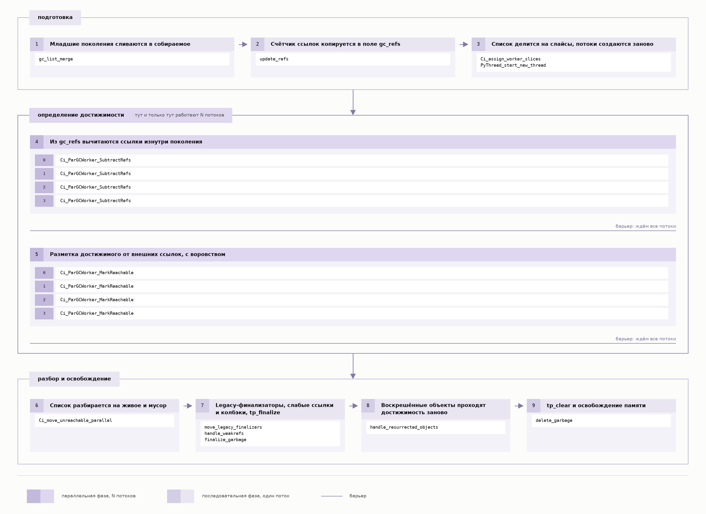

Сначала из скопированных счётчиков вычитаются ссылки, ведущие внутрь собираемого поколения: после этого ненулевой счётчик остаётся только у тех объектов, на кого ссылаются снаружи. Потом от них размечается всё достижимое. Оба прохода идут по графу через `tp_traverse` и оба заканчиваются барьером - дальше не двинется никто, пока не закончит самый медленный поток.

Всё остальное последовательно. Разбор списка на живое и мусор, вопреки имени `Ci_move_unreachable_parallel`, идёт в главном потоке. Финализаторы, слабые ссылки, `tp_clear` и освобождение памяти - тоже.

Значит, выигрыш ограничен долей этих двух проходов. А саму эту долю можно свести к нулю - заморозкой.

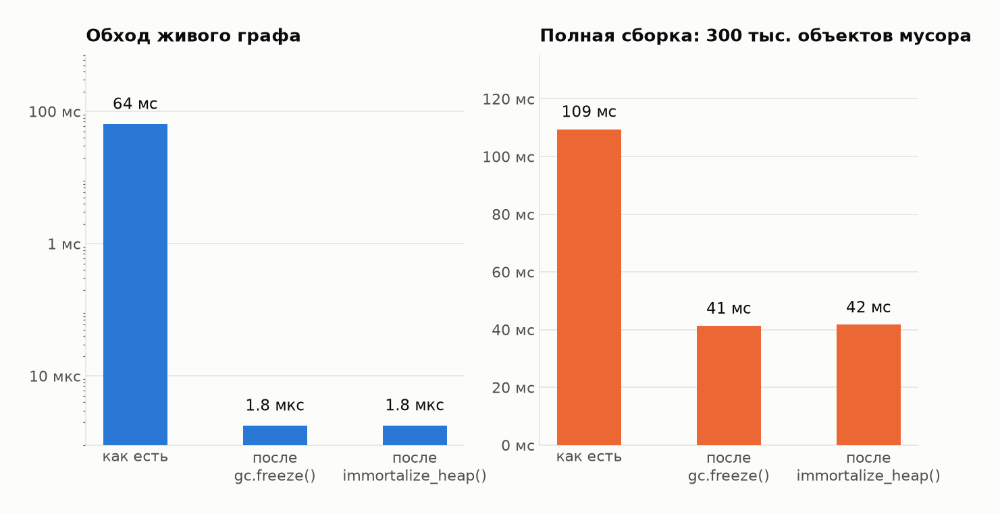

Левая панель: обход живого графа из 300 тысяч узлов - 64 мс. После `gc.freeze()` или `immortalize_heap()` - 1.8 мкс. В тридцать шесть тысяч раз меньше: замороженные объекты сборщик не обходит вовсе.

Правая панель - полная сборка с 300 тысячами объектов мусора: 109 мс как есть, 41 мс после заморозки. Здесь выигрыш всего в 2.65 раза: заморозка убирает из сборки обход живого графа, 64 мс, а триста тысяч объектов мусора остаются - их всё равно надо обойти и освободить.

Параллельный сборщик на этом же графе проигрывает, и крупно: четыре потока обходят его за 145 мс вместо 64, а полная сборка занимает 184 мс вместо 109. Но узлы здесь - объекты с тремя полями, и потоков четыре. Оба параметра для него неудачны, и разбирать их надо по отдельности.

#### Форма объектов решает, будет ли смысл вообще

Накладные расходы у него идут на объект, а не на работу: каждое посещение это атомарная операция над заголовком плюс обращение к очереди воровства. Поэтому при одной и той же куче в два миллиона ссылок всё зависит от того, как эти ссылки разложены по объектам. Коэффициент рядом со временем - во сколько раз параллельная сборка быстрее последовательной, то есть всё, что меньше единицы, это проигрыш.

| ссылок на объект | объектов | последовательно | 2 потока | 4 потока | 8 потоков |
|---|---|---|---|---|---|
| 3 | 666 тыс. | 40.1 мс | 115.1 мс, 0.35× | 111.1 мс, 0.36× | 75.5 мс, 0.53× |
| 10 | 200 тыс. | 17.1 мс | 49.0 мс, 0.35× | 38.5 мс, 0.44× | 29.7 мс, 0.58× |
| 30 | 67 тыс. | 12.7 мс | 26.5 мс, 0.48× | 21.8 мс, 0.58× | 16.6 мс, 0.77× |
| 100 | 20 тыс. | 12.2 мс | 26.2 мс, 0.46× | 15.9 мс, 0.76× | **10.8 мс, 1.12×** |

На узлах по три ссылки параллельная сборка проигрывает вдвое даже в лучшей своей конфигурации, и никакое число потоков этого не исправит. Выигрывать она начинает где-то между тридцатью и сотней ссылок на объект. Кэш витрин, на котором сборщик меряется дальше в воркшопе, держит сто семь с половиной ссылок на объект - то есть как раз за этой границей.

#### Сколько потоков ему нужно

Второй параметр - число потоков. Пула у сборщика нет: `PyThread_start_new_thread` вызывается прямо внутри обхода, и потоки создаются заново на каждую сборку. Сколько это стоит само по себе, видно на замороженной куче из предыдущего замера: последовательная сборка укладывается в 1.8 мкс, а четыре потока тратят 409 мкс на то, чтобы родиться и обнаружить, что работы нет.

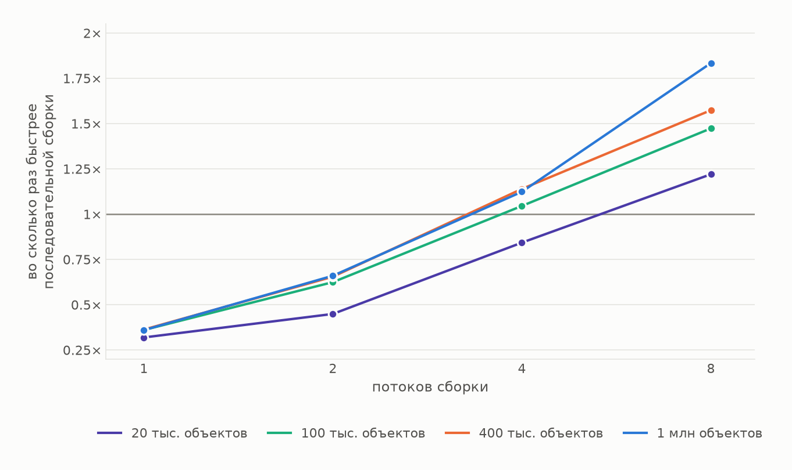

Один поток всегда примерно втрое хуже последовательной сборки: атомарность уже оплачена, а параллелизма, который бы её окупил, ещё нет. Два потока - в полтора раза хуже, а на самой мелкой куче вдвое с лишним. Четыре только выходят на уровень последовательной сборки. Выигрыш начинается на восьми: на миллионе объектов 601 мс превращаются в 328, то есть с каждой полной паузы снимается 273 мс.

Дальше первых двух точек кривая растёт почти пропорционально: каждое удвоение числа потоков ускоряет сборку примерно в полтора раза, и все четыре размера кучи ведут себя одинаково. Этого от параллельной разметки и ждут - работа делится на слайсы, слайсы расходятся по ядрам.

Размер кучи при этом решает, с какой точки начинается выигрыш. Чем толще слайс на воркер, тем меньше весит фиксированная цена создания потока: на миллионе объектов восемь потоков дают ускорение в 1.83 раза, на двадцати тысячах - только в 1.22.

По умолчанию берётся половина ядер машины. На четырёх ядрах это два потока, на двух - один, то есть обе точки из проигрышной части кривой. `num_threads` лучше задавать явно.

#### Когда параллельный сборщик окупается

Совпасть должны обе вещи: объекты с сотней ссылок каждый и восемь ядер, которые можно отдать под сборку. Тогда он выигрывает уже на двадцати тысячах таких объектов, и чем больше куча, тем больше выигрыш - почти пятая часть паузы на двадцати тысячах, почти половина на миллионе.

Форма кучи при этом любая. Кэш в памяти со сложными значениями, справочник или индекс, который сервис держит между запросами, разобранное дерево конфига, сессия ORM с десятками тысяч сущностей - подойдёт всё.

`min_generation=2` по умолчанию: параллельная ветка идёт только на полных сборках, и на аллокационном цикле её не видно - 0.493 мс против 0.489. Опускать порог не стоит: молодые сборки частые, каждая платит за создание потоков, и тот же цикл замедляется до 0.75-0.84 мс.

### Последовательность в родителе до форка

Всё вместе даёт одну последовательность в родителе до форка:

```python
import cinderx
import cinderx.jit as jit
from cinderx.compiler.strict.loader import install as install_strict_loader

cinderx.install_frame_evaluator()
install_strict_loader()
jit.enable()
import app

cinderx.enable_parallel_gc(min_generation=2, num_threads=N)
jit.precompile_all(workers=N)
cinderx.immortalize_heap()
```

Компиляция происходит на предпоследней строке: 88 мс на двести функций. Порядок тут важен: единицы компиляции регистрируются на создании функции и только если JIT уже включён, поэтому `jit.enable()` должен стоять до импорта приложения - иначе `precompile_all` отработает вхолостую. После неё родитель форкается, и в каждом воркере остаётся открыть пул соединений.

---

## Воркшоп: то же самое на сервисе

Сервис выдаёт item-to-item рекомендации по взвешенному графу совстречаемости. В каталоге сто тысяч товаров и двадцать тысяч пользователей, граф - два с половиной миллиона рёбер. Верхний процент товаров впятеро с лишним гуще связан с остальными и притягивает три восьмых всех рёбер, так что обход почти всегда выходит на эту сердцевину. Нагрузка адресует двадцать тысяч товаров и три тысячи пользователей.

Три ручки выбраны так, чтобы тратить время по трём разным причинам:

| ручка | конвейер | где время |
|---|---|---|
| `POST /v1/recommendations` | история из БД, обход графа на глубину 2, скоринг, бизнес-правила, top-K | **Python-байткод** |
| `GET /v1/items/{id}/similar` | эмбеддинг × матрица кандидатов, top-K по косинусу | **C, через numpy** |
| `GET /v1/items/{id}/bundle` | витрина из прогретого кэша, пересборка слотов, top-K | **паузы сборщика** |

Нагрузка - k6 в открытой модели, ступень 60 с после минуты прогрева вне зачёта, фикстура сбрасывается перед каждой конфигурацией. Ступень провалена, если p99 выше 1000 мс, ошибок больше 1 % или доставлено меньше 95 % предложенного.

### `POST /recommend`: где время уходит в байткод

Конвейер этой ручки - обход графа, скоринг и бизнес-правила - это чистый Python-байткод, то есть то, что CinderX умеет ускорять.

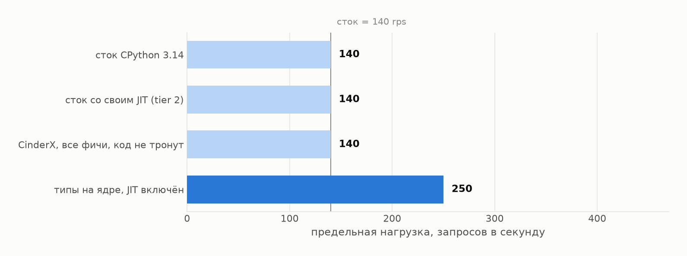

Сток CPython 3.14 держит 140 запросов в секунду. Сток со своим собственным JIT - те же 140. CinderX со всем, что в нём есть: установленный рантайм, включённый компилятор, предварительная компиляция горячих функций до форка, иммортализация кучи, параллельный сборщик. И **те же 140**.

Типы на ядре с включённым JIT - **250 rps**, почти вдвое больше стока, и это единственная конфигурация здесь, которая потребовала правок в коде.

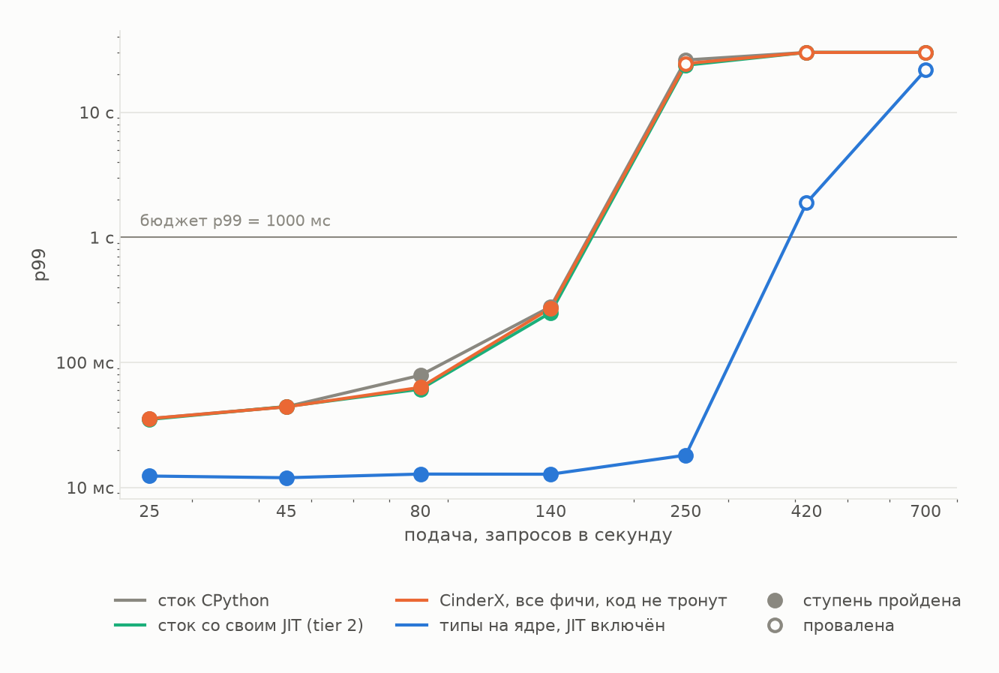

На стоке при 140 rps p99 составляет 279 мс - сервис уже у предела. С типами и JIT при той же подаче p99 равен **13 мс**: в двадцать раз меньше при той же нагрузке. Колено уезжает вправо на ступень подачи, и вплоть до 250 rps сервис держится в пределах 18 мс.

А вот хвост настройки не трогают. У всех конфигураций без правки кода p99 на 140 rps лежит между 220 и 460 мс, и кто из них лучше - меняется от прогона к прогону. Причина станет видна на третьей ручке: живая куча этого обработчика - справочник товаров, загруженный до форка и замороженный вместе с ним.

### `GET /similar`: где время уходит в C

Вторая ручка считает косинусную близость через numpy. После того как типы на ядре дали почти вдвое, напрашивается следующий ход: а если типизировать и её? Последняя конфигурация отвечает на это.

Три первые конфигурации неразличимы: `/similar` держит 330 запросов в секунду и на стоке, и на стоке с tier 2, и на CinderX со всеми включёнными фичами. Четвёртая, где на Static Python переписан уже и скан, даёт 35, и p99 на этой подаче растёт с 12 мс до 246.

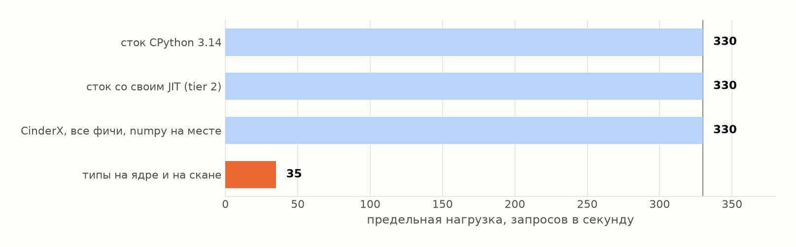

Первые три полосы объясняются просто: CinderX ускоряет байткод, а в этой ручке байткода не было - работа шла в numpy. Изолированный замер того же скана это подтверждает: 7.72 мс без расширения, 7.79 с установленным рантаймом, 8.35 с включённым компилятором. Быстрее не стало ни на одной конфигурации.

Четвёртая - это то, что происходит, когда работу возвращают в байткод, чтобы компилятору было что ускорять. Он её и ускорил, сильно: типизированный скан без JIT идёт 6310 мс, с JIT - 109, в пятьдесят восемь раз быстрее. Но ручка в сумме стала работать в девять раз хуже, потому что до переписывания та же работа не стоила почти ничего.

На задержках видно то же самое, только подробнее:

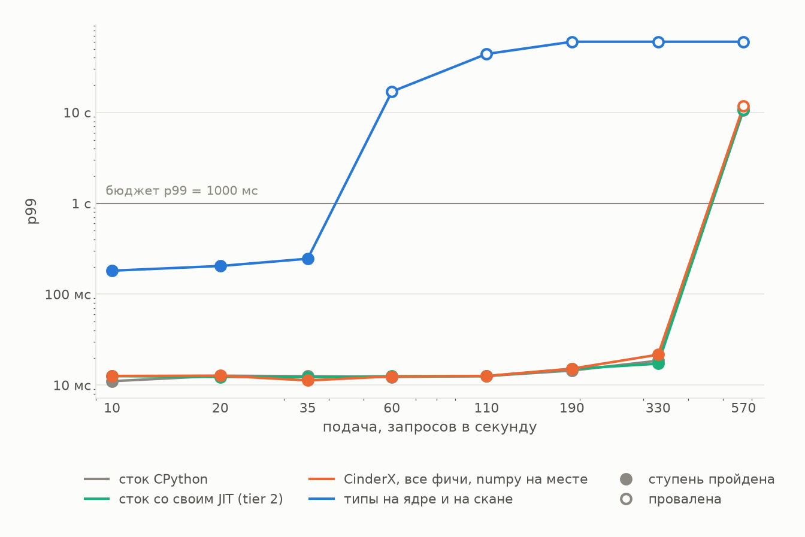

Три первые линии лежат друг на друге на двенадцати-тринадцати миллисекундах до 110-й подачи, дальше расходятся до 14-22 мс и обрываются вместе после 330-й. Четвёртая начинается на 182 мс - в четырнадцать раз выше - и вылетает за бюджет уже на шестидесяти запросах в секунду. Колено уезжает влево на четыре ступени подачи.

С хвостом здесь та же история, что и на `/recommend`: настройки не делают с ним ничего. До 110 запросов в секунду все три дают по 12-13 мс, на 190-й - 14-15, на 330-й расходятся до 17-22, и порядок там меняется от конфигурации к конфигурации. Считает эта ручка внутри numpy, над загруженной до форка матрицей, которую иммортализация убрала из обхода.

`/recommend` в той же конфигурации остался на 250 rps.

Долю байткода можно не только увеличить, но и случайно уменьшить: перенос работы из numpy обратно в Python обошёлся в девять раз ёмкости там, где типизация ядра принесла вдвое.

### `GET /bundle`: где время уходит в паузы сборщика

Третья ручка устроена так, чтобы дорого обходилась не работа, а память под ней. Воркер после форка прогревает кэш витрин: на каждый из сорока тысяч товаров - окрестность по графу совстречаемости, разложенная по пяти спискам в сто двадцать восемь элементов. Сам запрос дёшев: взять витрину из кэша, пересчитать сто двадцать восемь слотов, отдать двадцать четыре. На двух тысячах запросов в секунду медиана держится на двух миллисекундах. Исключение - сток, где она от прогона к прогону скачет между 1.9 и 12.8 мс.

Но этот кэш сборщик обходит целиком на каждой полной сборке: двести сорок тысяч отслеживаемых объектов, двадцать пять миллионов восемьсот тысяч ссылок, сто семь с половиной ссылок на объект. Ровно та форма, на которой параллельный сборщик окупается.

Но под заморозку этот кэш не попадает. `immortalize_heap()` вызывается в мастере gunicorn, до форка, и убирает из обхода граф, справочник и эмбеддинги. Витрины строятся в воркере, уже после форка, и остаются видимыми.

Сборка здесь идёт по таймеру, раз в две секунды, и каждая замеряется изнутри процесса. Поэтому у этой ручки есть то, чего нет у двух других: длительность самой паузы, а не только её след в хвосте запросов.

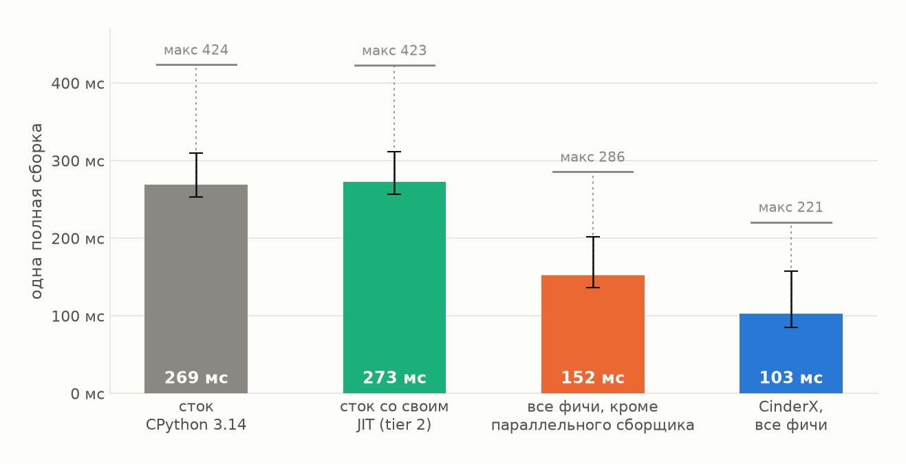

Заморозка снимает 1.76 раза, параллельный сборщик сверху - ещё 1.48. Вместе 269 мс превращаются в 103, максимум падает с 424 до 221. На tier 2 пауза та же, что на стоке: 273 мс против 269. JIT и сборщик не пересекаются нигде.

Ёмкость это не двигает вовсе: 4500 запросов в секунду на всех четырёх конфигурациях. Разница видна только в хвосте задержек.

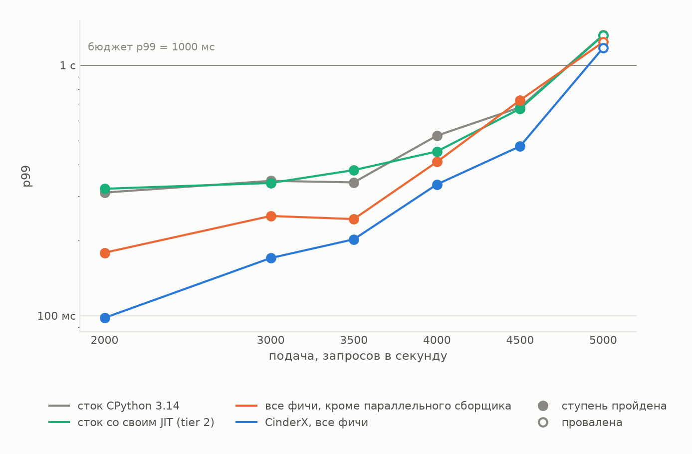

До четырёх тысяч обе линии CinderX идут ниже обеих стоковых, и порядок между ними тот же, что на паузах. На 4500 заморозка без сборщика выбивается наверх, а на пяти тысячах бюджет проваливают все четыре: там уже очередь, а не сборка.

Разброс между проходами на границе ёмкости велик, поэтому на втором графике у каждой конфигурации не одно число, а размах от лучшего прохода к худшему.

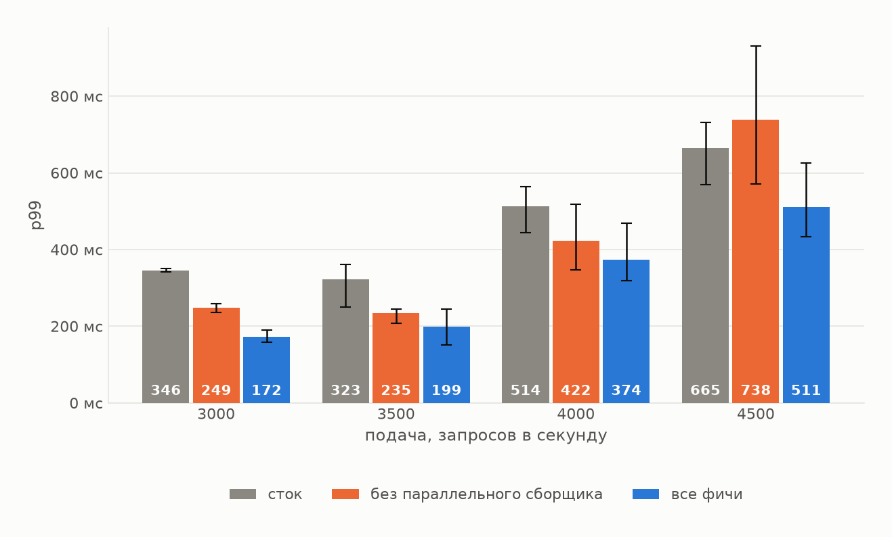

Разница между стоком и полным набором чистая на двух подачах из четырёх: 346 мс против 172 на трёх тысячах и 323 против 199 на 3500 - там размахи не пересекаются. Разделить внутри CinderX заморозку и сборщик выходит только на трёх тысячах, 249 против 172. Дальше заявлять нечего: на четырёх тысячах размахи наезжают друг на друга, а на 4500 это уже граница ёмкости, где разброс растягивается на полсекунды и накрывает все три конфигурации.

Поэтому замер самой паузы и нужен: там эти два шага разделены на каждой сборке, а не на одной подаче из четырёх.

Цифры сходятся с микрозамером. Полная сборка на такой же куче стоит 127 мс последовательно и 77 на четырёх потоках, с которыми работает сервис, то есть в 1.66 раза. В сервисе под нагрузкой тот же шаг даёт 1.48.

---

## Что из этого следует

Ёмкость сдвинул ровно один способ: типизированное ядро обхода графа под JIT, 250 запросов в секунду против 140 у стока. Всё, что включается флагами, не сдвинуло её ни разу - сток, сток с tier 2 и CinderX со всеми включёнными фичами дали одни и те же 140.

**Типы и JIT работают только вместе.** Типы без JIT - регресс в 3.4 раза: 172 нс на итерацию против 50.9 у обычного `int`. JIT без типов ускоряет байткод, но на лестнице это дало ноль. Вместе - 0.676 нс.

**Перенос работы из C обратно в Python обходится дороже, чем типизация приносит.** Типизированный скан эмбеддингов сам по себе ускорился в пятьдесят восемь раз, а ручка в сумме потеряла девять раз ёмкости: до переписывания та же работа шла в numpy и не стоила почти ничего.

**Флаги про память ёмкость не двигают, они укорачивают паузы.** На двух ручках из трёх это дало ровно ноль: всё, что эти обработчики читают, загружено до форка. На третьей, которая строит свой кэш уже в воркере, пауза укоротилась с 269 мс до 103.

**Параллельному сборщику нужны объекты с сотней ссылок и куча, построенная после форка.** На трёх ссылках он проигрывает при любом числе потоков.

**Посчитайте долю байткода до того, как начнёте.** Если сервис - это обвязка вокруг numpy, драйвера БД и pydantic, потолок известен заранее и равен нулю. Если это обход структур и бизнес-правила на чистом Python - потолок вдвое. Профайлер отвечает на этот вопрос сразу, а порт на Static Python - это модуль целиком: представление данных, сигнатуры, каждый счётчик и каждая константа.

И отдельно про сами замеры. Любой замер JIT через `force_compile` держится на одной проверке: сколько вызовов ушло в интерпретатор. Пока вы её не сделали, `is_jit_compiled()` ответит `True` и на функции, которую исполняет интерпретатор.

---

*Код замеров, сырые результаты и скрипты построения графиков - в репозитории, приложенном к статье. Каждая цифра в тексте имеет за собой файл результатов.*
